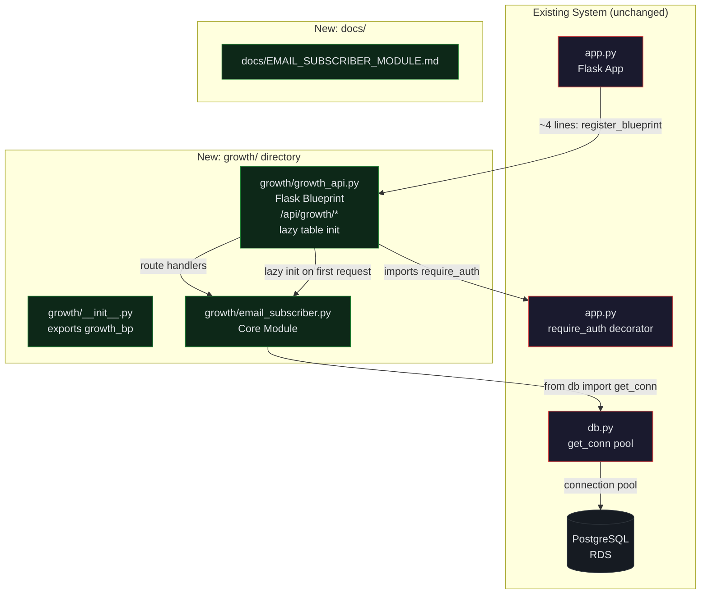
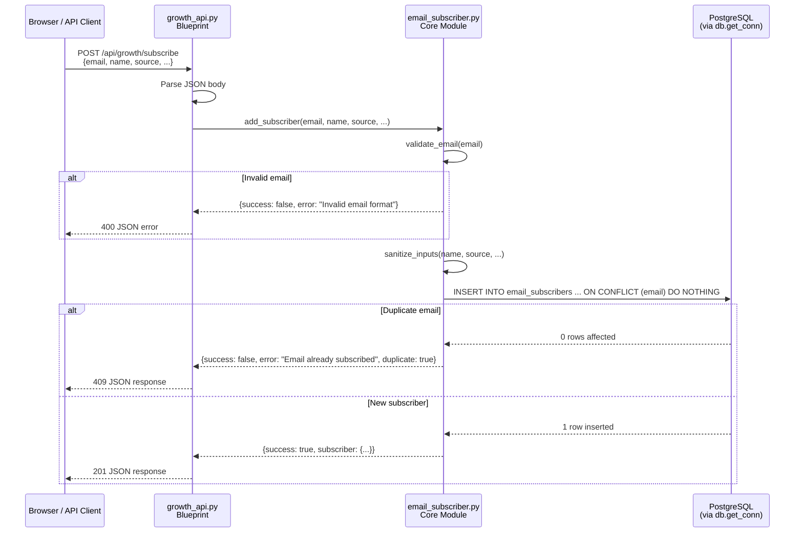
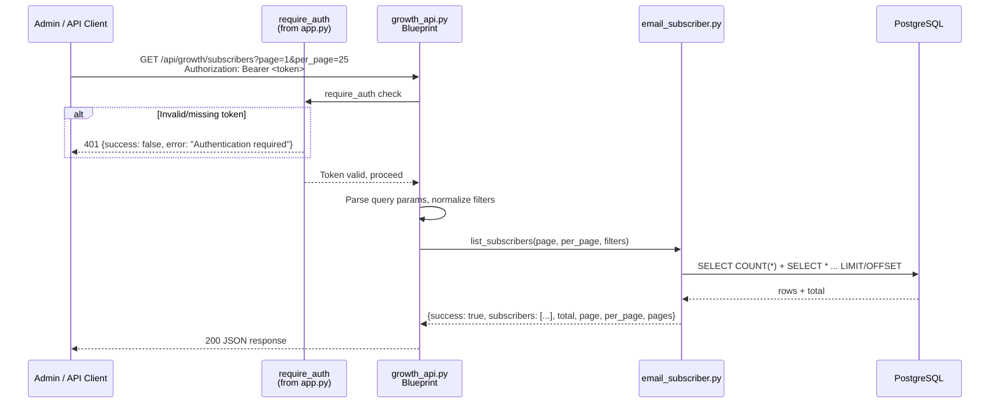

# Design Document: Email Subscriber Capture Module (Revised)

## Overview

The Email Subscriber Capture Module is the first isolated growth feature for ai1stseo.com, implementing a new `growth/` directory with a Flask Blueprint that provides subscriber collection, storage, and export capabilities. The module follows the established isolation pattern used by `answer_fingerprint.py` and `share_of_voice.py` — creating its own PostgreSQL table via `db.get_conn()` without modifying `db.py` or any shared files.

The only touch point with existing code is a single Blueprint registration block in `app.py` (~4 lines). Table initialization is handled entirely within the growth module via lazy-init on first request — `app.py` does NOT manage growth table setup. All business logic, validation, table initialization, and API routes live entirely within the `growth/` directory.

No email provider integration, lead magnets, or analytics are included — this is purely subscriber capture, storage, and export.

## Revision Summary

Changes from the original design based on review feedback:

1. **Minimized app.py touch**: Table init removed from app.py entirely. Lazy-init inside the growth module via `@growth_bp.before_app_request` (runs once). app.py only registers the Blueprint (~4 lines).
2. **Tightened export behavior**: Export defaults to JSON. CSV includes explicit `Content-Disposition` header with safe filename. Export bypasses pagination (returns all filtered rows). Empty CSV still returns headers.
3. **Security/access for list/export**: `require_auth` decorator from app.py is reused for `/subscribers` and `/subscribers/export`. Subscribe remains public. Endpoints are marked as internal/admin in code comments and docs.
4. **Safer DB/init**: `gen_random_uuid()` confirmed available (used in 6+ existing tables). `updated_at` is insert-only for now with documented future strategy. Schema init is fully idempotent.
5. **Filter normalization**: Filter inputs are lowercased/stripped to match stored value normalization.
6. **Strict export format validation**: Only `csv` or `json` accepted; anything else returns 400.
7. **Consistent error shape**: All endpoints return `{"success": bool, "error": str | null}`.

## Architecture



## Table Initialization Strategy (Revised)

Table init is **NOT** in `app.py`. Instead, `growth/growth_api.py` uses a module-level flag and `@growth_bp.before_app_request` to lazy-init the table on the first request that hits any growth endpoint:

```python
_table_initialized = False

@growth_bp.before_app_request
def _ensure_table():
    global _table_initialized
    if not _table_initialized:
        try:
            from growth.email_subscriber import init_subscriber_table
            init_subscriber_table()
            _table_initialized = True
        except Exception as e:
            logger.warning("email_subscribers table init deferred: %s", e)
```

This means:
- `app.py` never calls `init_subscriber_table()`
- Table is created on first request (lazy), not at import time
- If DB is unavailable at startup, the app still starts; init retries on next request
- Fully idempotent — `CREATE TABLE IF NOT EXISTS` + `CREATE INDEX IF NOT EXISTS`

## app.py Touch Points (Revised — Minimal)

The ONLY change to `app.py` is Blueprint registration (~4 lines):

```python
# Near the end of app.py, before the catch_all route:
try:
    from growth import growth_bp
    app.register_blueprint(growth_bp)
except Exception as e:
    print(f"⚠ growth Blueprint: {e}")
```

That's it. No table init, no import of `email_subscriber`, no other changes. The try/except ensures the app still starts even if the growth module has issues.

## Sequence Diagrams

### Subscribe Flow (Public — No Auth)



### List Subscribers Flow (Auth Required — Internal/Admin)



### Export Flow (Auth Required — Internal/Admin)

```mermaid
sequenceDiagram
    participant Client as Admin / API Client
    participant AUTH as require_auth
    participant BP as growth_api.py
    participant ES as email_subscriber.py
    participant DB as PostgreSQL

    Client->>BP: GET /api/growth/subscribers/export?format=csv<br/>Authorization: Bearer <token>
    BP->>AUTH: require_auth check
    AUTH-->>BP: Token valid
    BP->>BP: Validate format (csv|json only, default json)
    alt Invalid format
        BP-->>Client: 400 {success: false, error: "Invalid format. Use csv or json"}
    end
    BP->>ES: export_subscribers(format, filters)
    Note over ES: Export bypasses pagination — returns ALL filtered rows
    ES->>DB: SELECT * FROM email_subscribers WHERE ... ORDER BY subscribed_at DESC
    DB-->>ES: all matching rows
    alt format=csv
        ES->>ES: Build CSV with headers (even if 0 rows)
        ES-->>BP: CSV string
        BP-->>Client: 200 text/csv<br/>Content-Disposition: attachment; filename="subscribers_export_YYYYMMDD.csv"
    else format=json (default)
        ES-->>BP: list of dicts
        BP-->>Client: 200 application/json
    end
```

## Components and Interfaces (Revised)

### Component 1: `growth/email_subscriber.py` (Core Module)

**Purpose**: All subscriber business logic — validation, sanitization, CRUD, export, and table initialization. Zero Flask dependencies.

**Interface**:

```python
def init_subscriber_table() -> None:
    """Create email_subscribers table if not exists. Idempotent. Called via lazy-init."""

def validate_email(email: str) -> bool:
    """RFC-like email format check. Returns True if valid."""

def sanitize_input(value: str | None, max_length: int = 255) -> str | None:
    """Strip whitespace, truncate to max_length. Returns None if empty."""

def normalize_filter(value: str | None) -> str | None:
    """Strip and lowercase a filter value to match stored normalization."""

def add_subscriber(
    email: str,
    name: str | None = None,
    source: str = "unknown",
    platform: str | None = None,
    campaign: str | None = None,
    opted_in: bool = True,
) -> dict:
    """Validate, sanitize, and insert a subscriber. Returns result dict."""

def list_subscribers(
    page: int = 1,
    per_page: int = 25,
    source: str | None = None,
    platform: str | None = None,
    campaign: str | None = None,
) -> dict:
    """Paginated subscriber list with optional filters."""

def export_subscribers(
    fmt: str = "json",
    source: str | None = None,
    platform: str | None = None,
    campaign: str | None = None,
) -> str | list[dict]:
    """Export ALL matching subscribers (no pagination). CSV or JSON."""
```

### Component 2: `growth/growth_api.py` (Flask Blueprint — Revised)

**Purpose**: HTTP layer only — parse requests, call core module, format responses. Handles lazy table init and auth.

```python
import logging
from flask import Blueprint, request, jsonify, Response
from datetime import datetime

logger = logging.getLogger(__name__)
growth_bp = Blueprint("growth", __name__, url_prefix="/api/growth")

_table_initialized = False

@growth_bp.before_app_request
def _ensure_table():
    """Lazy-init the email_subscribers table on first request."""
    global _table_initialized
    if not _table_initialized:
        try:
            from growth.email_subscriber import init_subscriber_table
            init_subscriber_table()
            _table_initialized = True
        except Exception as e:
            logger.warning("email_subscribers table init deferred: %s", e)

# --- Public endpoint ---

@growth_bp.route("/subscribe", methods=["POST"])
def subscribe():
    """POST /api/growth/subscribe — Public. Add a new email subscriber."""
    ...

# --- Internal/Admin endpoints (auth required) ---
# These use the existing require_auth decorator from app.py.
# TEMPORARY: These are internal-only endpoints for admin use.
# Future: Add role-based access control when admin system is built.

@growth_bp.route("/subscribers", methods=["GET"])
def get_subscribers():
    """GET /api/growth/subscribers — INTERNAL/ADMIN. Paginated list with filters.
    Requires Authorization: Bearer <cognito_token> header."""
    ...

@growth_bp.route("/subscribers/export", methods=["GET"])
def export():
    """GET /api/growth/subscribers/export — INTERNAL/ADMIN. CSV or JSON export.
    Requires Authorization: Bearer <cognito_token> header.
    Defaults to JSON. CSV includes Content-Disposition header.
    Export returns ALL filtered rows (no pagination)."""
    ...
```

**Auth approach**: Import `require_auth` from `app` module and apply it to list/export endpoints. The decorator already exists in `app.py` (line ~1711) and checks Cognito tokens via `Authorization: Bearer` header or JSON body `token` field.

```python
# Inside growth_api.py:
from app import require_auth

@growth_bp.route("/subscribers", methods=["GET"])
@require_auth
def get_subscribers():
    ...
```

**Note**: If circular import issues arise from `from app import require_auth`, the fallback is to copy the decorator into `growth/growth_api.py` as a local helper (documented as temporary duplication). This is safer than restructuring app.py.

### Component 3: `growth/__init__.py`

```python
from growth.growth_api import growth_bp
```

## Data Models (Revised)

### Table: `email_subscribers`

```sql
CREATE TABLE IF NOT EXISTS email_subscribers (
    id UUID PRIMARY KEY DEFAULT gen_random_uuid(),
    email VARCHAR(255) NOT NULL UNIQUE,
    name VARCHAR(255),
    source VARCHAR(100) DEFAULT 'unknown',
    platform VARCHAR(100),
    campaign VARCHAR(255),
    opted_in BOOLEAN DEFAULT TRUE,
    status VARCHAR(50) DEFAULT 'active',
    subscribed_at TIMESTAMP DEFAULT NOW(),
    updated_at TIMESTAMP DEFAULT NOW()
);

CREATE INDEX IF NOT EXISTS idx_es_email ON email_subscribers(email);
CREATE INDEX IF NOT EXISTS idx_es_source ON email_subscribers(source);
CREATE INDEX IF NOT EXISTS idx_es_platform ON email_subscribers(platform);
CREATE INDEX IF NOT EXISTS idx_es_campaign ON email_subscribers(campaign);
CREATE INDEX IF NOT EXISTS idx_es_subscribed ON email_subscribers(subscribed_at DESC);
```

**UUID strategy**: `gen_random_uuid()` is confirmed available — used in 6+ existing tables (`projects`, `geo_probes`, `ai_visibility_history`, `answer_fingerprints`, `model_comparisons`, `share_of_voice`, `prompt_simulations`). No fallback needed.

**`updated_at` strategy**: Insert-only for now. The column is set to `DEFAULT NOW()` on insert and is NOT updated on any operation in this version. Future strategy: when unsubscribe/status-change features are added, use `UPDATE ... SET updated_at = NOW()` in those specific operations. This avoids adding triggers or complex logic for a field that has no consumer yet.

**Validation Rules**:
- `email`: Required, must match `^[a-zA-Z0-9._%+-]+@[a-zA-Z0-9.-]+\.[a-zA-Z]{2,}$`, stored lowercase, unique
- `name`: Optional, max 255 chars, stripped
- `source`: Optional, defaults to `"unknown"`, max 100 chars, stored lowercase
- `platform`: Optional, max 100 chars, stored lowercase
- `campaign`: Optional, max 255 chars, stored lowercase
- `opted_in`: Optional, defaults to `True`
- `status`: System-managed, one of `"active"`, `"unsubscribed"`, `"bounced"`. Always `"active"` on insert.

## Key Functions with Formal Specifications (Revised)

### Function 1: `init_subscriber_table()`

```python
def init_subscriber_table() -> None:
    """Create email_subscribers table and indexes. Idempotent. Called via lazy-init."""
    from db import get_conn
    with get_conn() as conn:
        cur = conn.cursor()
        cur.execute("""
            CREATE TABLE IF NOT EXISTS email_subscribers (
                id UUID PRIMARY KEY DEFAULT gen_random_uuid(),
                email VARCHAR(255) NOT NULL UNIQUE,
                name VARCHAR(255),
                source VARCHAR(100) DEFAULT 'unknown',
                platform VARCHAR(100),
                campaign VARCHAR(255),
                opted_in BOOLEAN DEFAULT TRUE,
                status VARCHAR(50) DEFAULT 'active',
                subscribed_at TIMESTAMP DEFAULT NOW(),
                updated_at TIMESTAMP DEFAULT NOW()
            )
        """)
        for idx in [
            "CREATE INDEX IF NOT EXISTS idx_es_email ON email_subscribers(email)",
            "CREATE INDEX IF NOT EXISTS idx_es_source ON email_subscribers(source)",
            "CREATE INDEX IF NOT EXISTS idx_es_platform ON email_subscribers(platform)",
            "CREATE INDEX IF NOT EXISTS idx_es_campaign ON email_subscribers(campaign)",
            "CREATE INDEX IF NOT EXISTS idx_es_subscribed ON email_subscribers(subscribed_at DESC)",
        ]:
            try:
                cur.execute(idx)
            except Exception:
                pass
        conn.commit()
```

### Function 2: `validate_email(email)`

```python
import re
EMAIL_REGEX = re.compile(r"^[a-zA-Z0-9._%+\-]+@[a-zA-Z0-9.\-]+\.[a-zA-Z]{2,}$")

def validate_email(email: str) -> bool:
    if not email or not isinstance(email, str):
        return False
    return bool(EMAIL_REGEX.match(email.strip()))
```

### Function 3: `sanitize_input(value, max_length)`

```python
def sanitize_input(value: str | None, max_length: int = 255) -> str | None:
    if value is None:
        return None
    cleaned = str(value).strip()
    if not cleaned:
        return None
    return cleaned[:max_length]
```

### Function 4: `normalize_filter(value)` (New)

```python
def normalize_filter(value: str | None) -> str | None:
    """Normalize a filter input to match stored value format (lowercase, stripped)."""
    if value is None:
        return None
    cleaned = str(value).strip().lower()
    return cleaned if cleaned else None
```

**Purpose**: Filter inputs (source, platform, campaign) are normalized the same way as stored values. Since `add_subscriber` stores source/platform/campaign as lowercase, filters must also be lowercased for correct matching.

### Function 5: `add_subscriber(email, name, source, platform, campaign, opted_in)` (Revised)

```python
def add_subscriber(
    email: str,
    name: str | None = None,
    source: str = "unknown",
    platform: str | None = None,
    campaign: str | None = None,
    opted_in: bool = True,
) -> dict:
    if not validate_email(email):
        return {"success": False, "error": "Invalid email format"}

    clean_email = email.strip().lower()
    clean_name = sanitize_input(name)
    clean_source = (sanitize_input(source, 100) or "unknown").lower()
    clean_platform = sanitize_input(platform, 100)
    if clean_platform:
        clean_platform = clean_platform.lower()
    clean_campaign = sanitize_input(campaign)
    if clean_campaign:
        clean_campaign = clean_campaign.lower()

    from db import get_conn
    try:
        with get_conn() as conn:
            cur = conn.cursor()
            cur.execute("""
                INSERT INTO email_subscribers (email, name, source, platform, campaign, opted_in)
                VALUES (%s, %s, %s, %s, %s, %s)
                ON CONFLICT (email) DO NOTHING
                RETURNING id, email, subscribed_at
            """, (clean_email, clean_name, clean_source, clean_platform, clean_campaign, opted_in))
            row = cur.fetchone()
            conn.commit()
            if row is None:
                return {"success": False, "error": "Email already subscribed", "duplicate": True}
            return {
                "success": True,
                "subscriber": {
                    "id": str(row[0]),
                    "email": row[1],
                    "subscribed_at": row[2].isoformat() if row[2] else None,
                },
            }
    except Exception as e:
        return {"success": False, "error": f"Database error: {str(e)}"}
```

**Key change**: `source`, `platform`, and `campaign` are now stored lowercase to enable consistent filtering.

### Function 6: `list_subscribers(page, per_page, source, platform, campaign)` (Revised)

```python
import psycopg2.extras

def list_subscribers(
    page: int = 1,
    per_page: int = 25,
    source: str | None = None,
    platform: str | None = None,
    campaign: str | None = None,
) -> dict:
    page = max(1, page)
    per_page = max(1, min(per_page, 100))
    offset = (page - 1) * per_page

    # Normalize filters to match stored lowercase values
    clauses, params = [], []
    for val, col in [(normalize_filter(source), "source"),
                     (normalize_filter(platform), "platform"),
                     (normalize_filter(campaign), "campaign")]:
        if val:
            clauses.append(f"{col} = %s")
            params.append(val)

    where = ("WHERE " + " AND ".join(clauses)) if clauses else ""

    from db import get_conn
    try:
        with get_conn() as conn:
            cur = conn.cursor(cursor_factory=psycopg2.extras.RealDictCursor)
            cur.execute(f"SELECT COUNT(*) AS cnt FROM email_subscribers {where}", params)
            total = cur.fetchone()["cnt"]
            cur.execute(
                f"SELECT * FROM email_subscribers {where} ORDER BY subscribed_at DESC LIMIT %s OFFSET %s",
                params + [per_page, offset],
            )
            rows = cur.fetchall()
            for r in rows:
                r["id"] = str(r["id"])
                if r.get("subscribed_at"):
                    r["subscribed_at"] = r["subscribed_at"].isoformat()
                if r.get("updated_at"):
                    r["updated_at"] = r["updated_at"].isoformat()
            return {
                "success": True,
                "subscribers": rows,
                "total": total,
                "page": page,
                "per_page": per_page,
                "pages": max(1, (total + per_page - 1) // per_page),
            }
    except Exception as e:
        return {"success": False, "error": f"Database error: {str(e)}", "subscribers": []}
```

**Key change**: Filters are normalized via `normalize_filter()` before comparison.

### Function 7: `export_subscribers(fmt, source, platform, campaign)` (Revised)

```python
import csv
import io

CSV_HEADERS = ["id", "email", "name", "source", "platform", "campaign", "opted_in", "status", "subscribed_at"]

def export_subscribers(
    fmt: str = "json",
    source: str | None = None,
    platform: str | None = None,
    campaign: str | None = None,
) -> str | list[dict]:
    """Export ALL matching subscribers (no pagination). Returns CSV string or list of dicts."""
    # Normalize filters
    clauses, params = [], []
    for val, col in [(normalize_filter(source), "source"),
                     (normalize_filter(platform), "platform"),
                     (normalize_filter(campaign), "campaign")]:
        if val:
            clauses.append(f"{col} = %s")
            params.append(val)

    where = ("WHERE " + " AND ".join(clauses)) if clauses else ""

    from db import get_conn
    with get_conn() as conn:
        cur = conn.cursor(cursor_factory=psycopg2.extras.RealDictCursor)
        cur.execute(
            f"SELECT id, email, name, source, platform, campaign, opted_in, status, subscribed_at "
            f"FROM email_subscribers {where} ORDER BY subscribed_at DESC",
            params,
        )
        rows = cur.fetchall()
        for r in rows:
            r["id"] = str(r["id"])
            if r.get("subscribed_at"):
                r["subscribed_at"] = r["subscribed_at"].isoformat()

    if fmt == "csv":
        output = io.StringIO()
        writer = csv.DictWriter(output, fieldnames=CSV_HEADERS)
        writer.writeheader()  # Always write headers, even if 0 rows
        writer.writerows(rows)
        return output.getvalue()

    return rows  # JSON (default)
```

**Key changes**:
- Default format is `json` (not csv)
- CSV always includes headers even with 0 rows
- Export returns ALL filtered rows (no LIMIT/OFFSET — bypasses pagination)
- Filters are normalized

## Endpoint Contract Summary (Revised)

### POST /api/growth/subscribe (Public — No Auth)

| Field | Value |
|-------|-------|
| Method | POST |
| Auth | None (public) |
| Content-Type | application/json |
| Request Body | `{"email": "...", "name": "...", "source": "...", "platform": "...", "campaign": "...", "opted_in": true}` |
| Required fields | `email` |
| Defaults | `source="unknown"`, `opted_in=true` |

**Responses:**

| Status | Body | Condition |
|--------|------|-----------|
| 201 | `{"success": true, "subscriber": {"id": "...", "email": "...", "subscribed_at": "..."}}` | New subscriber created |
| 400 | `{"success": false, "error": "Email is required"}` | Missing email |
| 400 | `{"success": false, "error": "Invalid email format"}` | Bad email format |
| 409 | `{"success": false, "error": "Email already subscribed", "duplicate": true}` | Duplicate email |
| 500 | `{"success": false, "error": "Database error: ..."}` | DB unavailable |

### GET /api/growth/subscribers (Auth Required — Internal/Admin)

| Field | Value |
|-------|-------|
| Method | GET |
| Auth | `Authorization: Bearer <cognito_token>` |
| Query params | `page` (default 1), `per_page` (default 25, max 100), `source`, `platform`, `campaign` |

**Responses:**

| Status | Body | Condition |
|--------|------|-----------|
| 200 | `{"success": true, "subscribers": [...], "total": N, "page": P, "per_page": N, "pages": N}` | Success |
| 401 | `{"status": "error", "message": "Authentication required"}` | Missing/invalid token |
| 500 | `{"success": false, "error": "Database error: ...", "subscribers": []}` | DB unavailable |

### GET /api/growth/subscribers/export (Auth Required — Internal/Admin)

| Field | Value |
|-------|-------|
| Method | GET |
| Auth | `Authorization: Bearer <cognito_token>` |
| Query params | `format` (default `json`, accepts `csv` or `json`), `source`, `platform`, `campaign` |
| Pagination | None — returns ALL filtered rows |

**Responses:**

| Status | Body | Condition |
|--------|------|-----------|
| 200 | JSON array or CSV text | Success |
| 400 | `{"success": false, "error": "Invalid format. Use csv or json"}` | Bad format param |
| 401 | `{"status": "error", "message": "Authentication required"}` | Missing/invalid token |

**CSV response headers:**
```
Content-Type: text/csv; charset=utf-8
Content-Disposition: attachment; filename="subscribers_export_20260404.csv"
```

## Security & Access Control (Revised)

### Auth Strategy

The repo has an existing `require_auth` decorator in `app.py` (line ~1711) that validates Cognito access tokens via `Authorization: Bearer` header or JSON body `token` field. It sets `request.cognito_user` on success.

**Endpoint access levels:**

| Endpoint | Access | Auth | Rationale |
|----------|--------|------|-----------|
| POST /api/growth/subscribe | Public | None | Must be accessible from frontend signup forms, landing pages, etc. |
| GET /api/growth/subscribers | Internal/Admin | `require_auth` | Contains PII (emails, names). Admin-only for now. |
| GET /api/growth/subscribers/export | Internal/Admin | `require_auth` | Bulk PII export. Admin-only for now. |

**Implementation approach:**
1. Import `require_auth` from `app` module in `growth_api.py`
2. Apply as decorator to list/export endpoints
3. If circular import occurs (app imports growth, growth imports app), use a local auth helper that duplicates the Cognito token check — documented as temporary

**Future improvements (NOT built now):**
- Role-based access control (admin vs user)
- API key auth for programmatic access
- Rate limiting on subscribe endpoint

### Security Measures

- Email stored lowercase → prevents case-based duplicate bypass
- All string inputs stripped and truncated → prevents oversized payloads
- Parameterized queries (`%s` placeholders) → prevents SQL injection
- `ON CONFLICT DO NOTHING` → prevents timing-based email enumeration
- No PII beyond email and optional name
- Export requires auth → bulk PII not publicly accessible

## Correctness Properties (Revised)

1. **Email uniqueness**: For any two `add_subscriber` calls with the same email (case-insensitive), only the first returns `success: true`. The second returns `duplicate: true` without crashing.

2. **Email normalization**: `add_subscriber("User@Example.COM")` stores `"user@example.com"`. All comparisons are case-insensitive via lowercase storage.

3. **Validation rejects invalid emails**: For any string `s` not matching the email regex, `add_subscriber(s)` returns `{"success": false, "error": "Invalid email format"}` and no row is inserted.

4. **Sanitization bounds**: For any input string `s` and `max_length` `n`, `len(sanitize_input(s, n)) <= n` when result is not None.

5. **Filter normalization**: `normalize_filter("Website")` returns `"website"`. Filters match stored values regardless of input case.

6. **Pagination correctness**: `list_subscribers(page=p, per_page=n)` returns at most `n` items with `offset = (p-1) * n`.

7. **Pagination bounds**: `page` clamped to >= 1, `per_page` clamped to [1, 100]. No negative offsets.

8. **Export completeness**: `export_subscribers()` with no filters returns ALL rows. No pagination applied.

9. **CSV/JSON equivalence**: `export_subscribers(fmt="csv")` and `export_subscribers(fmt="json")` return the same data. Row count is identical.

10. **CSV always has headers**: Even with 0 rows, CSV export includes the header row.

11. **Export format validation**: Only `"csv"` and `"json"` are accepted. Any other value returns 400.

12. **Graceful DB failure**: If DB is unavailable, all functions return `{"success": false, "error": "Database error: ..."}` instead of raising unhandled exceptions.

13. **Isolation guarantee**: The module only reads/writes `email_subscribers`. No other tables are touched. `app.py` only has ~4 lines for Blueprint registration.

14. **Consistent error shape**: All error responses include `{"success": false, "error": "..."}`.

## Error Handling (Revised)

All error responses follow the consistent shape: `{"success": false, "error": "<message>"}`.

| Scenario | HTTP Status | Response |
|----------|-------------|----------|
| Invalid email format | 400 | `{"success": false, "error": "Invalid email format"}` |
| Missing email | 400 | `{"success": false, "error": "Email is required"}` |
| Duplicate email | 409 | `{"success": false, "error": "Email already subscribed", "duplicate": true}` |
| Invalid export format | 400 | `{"success": false, "error": "Invalid format. Use csv or json"}` |
| Missing/invalid auth token | 401 | `{"status": "error", "message": "Authentication required"}` (from require_auth) |
| Database unavailable | 500 | `{"success": false, "error": "Database error: ..."}` |
| Missing request body | 400 | `{"success": false, "error": "Email is required"}` |

**Note**: The 401 response shape comes from the existing `require_auth` decorator and uses `{"status": "error", "message": "..."}` format. This is intentionally kept as-is to avoid modifying the shared decorator. All growth-module-owned responses use `{"success": false, "error": "..."}`.

## Testing Strategy

### Manual Test Steps (Minimum)

```bash
# 1. Subscribe (public)
curl -X POST http://localhost:5000/api/growth/subscribe \
  -H "Content-Type: application/json" \
  -d '{"email": "test@example.com", "name": "Test User", "source": "website"}'
# Expect: 201

# 2. Duplicate subscribe
curl -X POST http://localhost:5000/api/growth/subscribe \
  -H "Content-Type: application/json" \
  -d '{"email": "test@example.com"}'
# Expect: 409

# 3. Invalid email
curl -X POST http://localhost:5000/api/growth/subscribe \
  -H "Content-Type: application/json" \
  -d '{"email": "not-an-email"}'
# Expect: 400

# 4. List subscribers (auth required)
curl http://localhost:5000/api/growth/subscribers \
  -H "Authorization: Bearer <your_cognito_token>"
# Expect: 200

# 5. Export JSON (auth required, default format)
curl http://localhost:5000/api/growth/subscribers/export \
  -H "Authorization: Bearer <your_cognito_token>"
# Expect: 200 JSON array

# 6. Export CSV (auth required)
curl http://localhost:5000/api/growth/subscribers/export?format=csv \
  -H "Authorization: Bearer <your_cognito_token>"
# Expect: 200 text/csv with Content-Disposition header

# 7. Invalid export format
curl http://localhost:5000/api/growth/subscribers/export?format=xml \
  -H "Authorization: Bearer <your_cognito_token>"
# Expect: 400

# 8. List without auth
curl http://localhost:5000/api/growth/subscribers
# Expect: 401
```

### Property-Based Testing (if hypothesis is available)

- For any valid email, `validate_email` returns True
- For any string `s` and int `n > 0`, `sanitize_input(s, n)` returns None or string with `len <= n`
- For any `page >= 1` and `1 <= per_page <= 100`, list returns `len(subscribers) <= per_page`

## Dependencies

- `psycopg2` — already in `requirements.txt`
- `flask` — already in `requirements.txt`
- No new dependencies required

## Revised File Plan

| File | Action | Purpose |
|------|--------|---------|
| `growth/__init__.py` | Create | Package init, exports `growth_bp` |
| `growth/email_subscriber.py` | Create | Core module: validation, CRUD, export, table init (lazy) |
| `growth/growth_api.py` | Create | Flask Blueprint with 3 endpoints, lazy table init, auth on list/export |
| `docs/EMAIL_SUBSCRIBER_MODULE.md` | Create | Documentation |
| `app.py` | Modify (~4 lines) | Blueprint registration only. NO table init. |

## Revised app.py Touch Points

**Before (original design):** ~10 lines — Blueprint registration + table init
**After (revised):** ~4 lines — Blueprint registration ONLY

```python
# The ONLY addition to app.py (near end, before catch_all route):
try:
    from growth import growth_bp
    app.register_blueprint(growth_bp)
except Exception as e:
    print(f"⚠ growth Blueprint: {e}")
```

## Remaining Risks

| Risk | Severity | Mitigation |
|------|----------|------------|
| Circular import: `growth_api.py` imports `require_auth` from `app.py`, while `app.py` imports `growth_bp` from `growth/` | Medium | Use late import (`from app import require_auth` inside the route function, not at module level). If still fails, duplicate the auth check locally as documented fallback. |
| Lazy table init fails silently on first request | Low | The `_ensure_table` handler logs warnings and retries on every request until success. First subscriber POST will fail with a DB error if table doesn't exist, which is a clear signal. |
| `require_auth` decorator response shape differs from growth module shape | Low | Documented. The 401 response uses `{"status": "error", "message": "..."}` from the existing decorator. Growth-owned responses use `{"success": false, "error": "..."}`. Consistent within each layer. |
| Large export with many subscribers could be slow | Low | Acceptable for initial version. Future: add streaming CSV or pagination option for export. |
| No rate limiting on public subscribe endpoint | Medium | Acceptable for initial version. Future: add rate limiting via Flask-Limiter or custom middleware. |
