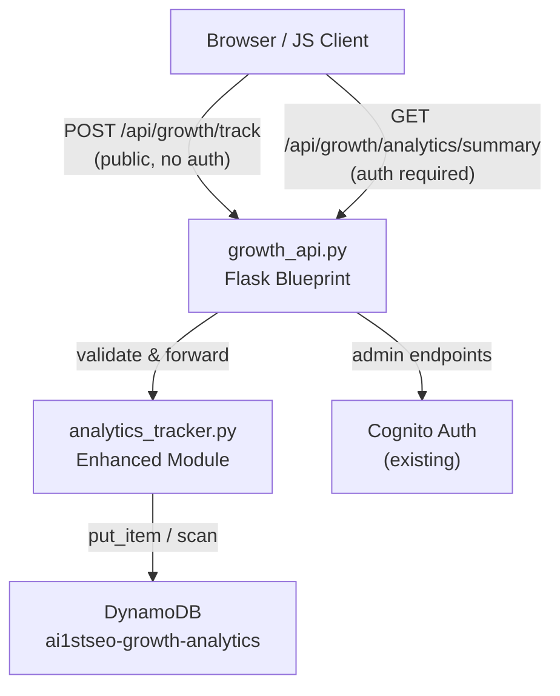
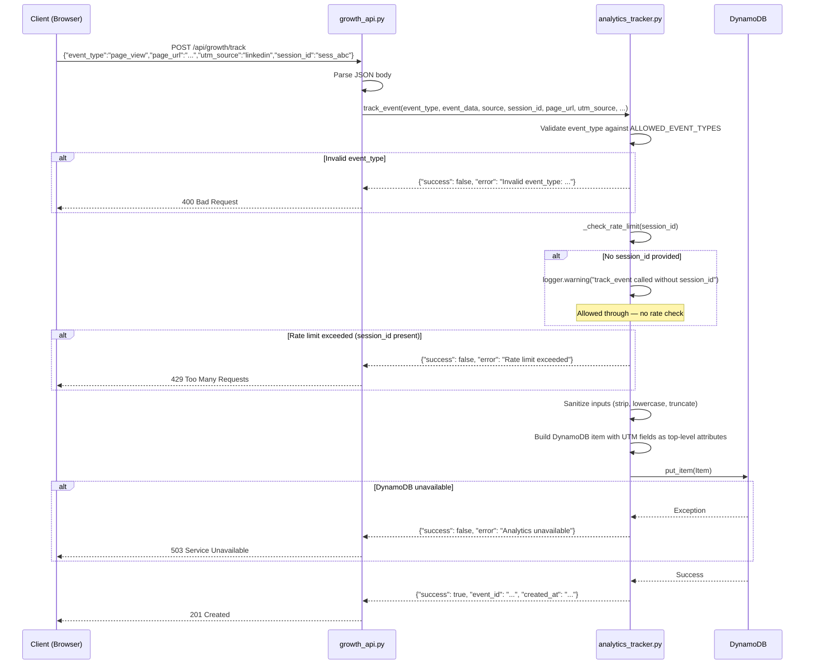
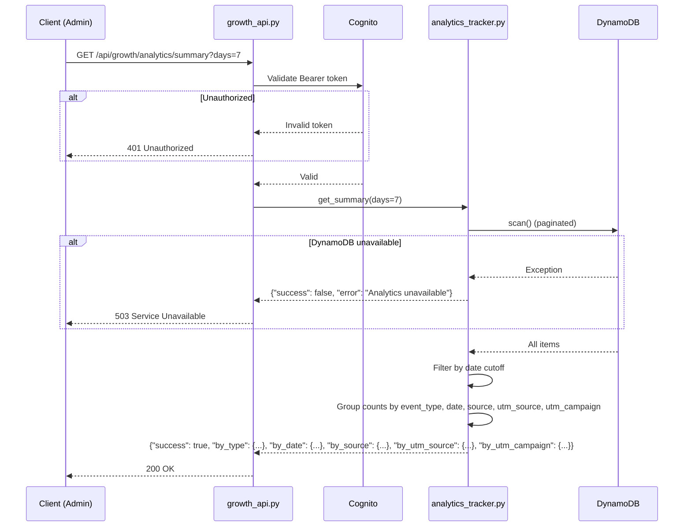

# Design Document: Growth Analytics Tracker (DynamoDB Enhancement)

## Overview

This feature enhances the existing `growth/analytics_tracker.py` module to support UTM-enriched event tracking, an expanded set of allowed event types, multi-dimensional summary grouping (by event_type, date, source, utm_source, utm_campaign), input validation, and graceful DynamoDB failure handling.

The existing DynamoDB table `ai1stseo-growth-analytics` uses a composite key of `event_type` (HASH) + `created_at` (RANGE). The current `get_summary()` performs a full table scan and groups only by `event_type`. The enhancement adds UTM fields as top-level item attributes, validates event types against an allowlist, and builds a richer summary response — all while keeping changes isolated to `growth/analytics_tracker.py` and `growth/growth_api.py`.

No new tables are created. No GSIs are added in this phase — the summary endpoint continues to scan (suitable for the current low-to-medium event volume). If volume grows, a GSI on `source` or a pre-aggregated counts table can be added later without breaking the API contract.

## Architecture



### Isolation Strategy

- All changes are confined to `growth/analytics_tracker.py` and `growth/growth_api.py`
- No changes to `app.py`, `utm_manager.py`, `social_scheduler_dynamo.py`, or any shared files
- No new DynamoDB tables — reuses existing `ai1stseo-growth-analytics`
- No new environment variables — reuses `GROWTH_ANALYTICS_TABLE` and `AWS_REGION`
- No new Blueprint registration — `growth_bp` already registered in `app.py`

## Sequence Diagrams

### Track Event Flow (POST /api/growth/track)



### Summary Flow (GET /api/growth/analytics/summary)



## Components and Interfaces

### Component 1: analytics_tracker.py (Enhanced)

**Purpose**: Core analytics module — validates, stores, and queries growth events in DynamoDB.

**New Constants**:

```python
ALLOWED_EVENT_TYPES = frozenset([
    "page_view",
    "email_signup_started",
    "email_signup_completed",
    "lead_magnet_clicked",
    "newsletter_cta_clicked",
    "subscriber_exported",
    "subscriber_list_viewed",
])

MAX_STRING_LENGTH = 2048  # Truncation limit for free-text fields

# --- Rate Limiting (in-memory, dev safety guard) ---
RATE_LIMIT_MAX_EVENTS = 20        # Max events per session_id per window
RATE_LIMIT_WINDOW_SECONDS = 60    # Sliding window size in seconds
```

**In-Memory Rate Limit State**:

```python
# Process-local dict — resets on restart, not shared across instances.
# Acceptable for a dev safety guard against accidental spam.
_session_event_log: dict[str, list[float]] = {}
# Maps session_id → list of Unix timestamps of recent track_event calls
```

**Enhanced Interface**:

```python
def track_event(
    event_type: str,
    event_data: dict = None,
    source: str = None,
    session_id: str = None,
    # --- NEW UTM fields ---
    page_url: str = None,
    utm_source: str = None,
    utm_medium: str = None,
    utm_campaign: str = None,
    utm_content: str = None,
    utm_term: str = None,
) -> dict:
    """Log an analytics event with optional UTM attribution."""
    ...

def get_summary(days: int = 7) -> dict:
    """Get event counts grouped by event_type, date, source, utm_source, utm_campaign."""
    ...
```

**Responsibilities**:
- Validate `event_type` against `ALLOWED_EVENT_TYPES`
- Sanitize all string inputs (strip whitespace, lowercase where appropriate, truncate)
- Store UTM fields as top-level DynamoDB attributes (not nested inside `event_data`)
- Build multi-dimensional summary groupings
- Catch and log DynamoDB exceptions, return graceful error dicts

### Component 2: growth_api.py (Enhanced Endpoints)

**Purpose**: Flask Blueprint routes — parses HTTP requests, delegates to analytics_tracker, returns JSON.

**Enhanced Interface**:

```python
# POST /api/growth/track — Public, no auth
# Accepts expanded JSON body with UTM fields
# Returns 201 on success, 400 on validation error, 429 on rate limit, 503 on DynamoDB failure

# GET /api/growth/analytics/summary — Auth required
# Query params: days (default 7, max 90)
# Returns multi-dimensional grouped counts
```

**Responsibilities**:
- Extract UTM fields from request JSON and pass to `track_event()`
- Silently ignore any `created_at` or `event_id` fields in the client request JSON — these are always server-generated by `track_event()`
- Map tracker return values to appropriate HTTP status codes (400 for validation, 429 for rate limit, 503 for DB errors)
- No business logic in the API layer — pure delegation

## Data Models

### DynamoDB Table: ai1stseo-growth-analytics (Existing — No Schema Change)

**Key Schema** (unchanged):
- Partition Key: `event_type` (String)
- Sort Key: `created_at` (String, ISO 8601)

**Item Structure** (enhanced — new attributes in bold comments):

```python
{
    "event_type": "page_view",           # HASH key — now validated against allowlist
    "created_at": "2026-01-15T10:30:00+00:00",  # RANGE key
    "event_id": "a1b2c3d4-...",          # UUID, existing
    "source": "website_main",            # existing
    "session_id": "sess_abc123",         # existing, optional
    "event_data": {"key": "value"},      # existing, optional nested map
    # --- NEW top-level UTM attributes ---
    "page_url": "https://ai1stseo.com/blog/seo-tips",
    "utm_source": "linkedin",
    "utm_medium": "social",
    "utm_campaign": "launch_2026",
    "utm_content": "banner_v2",
    "utm_term": "seo tools",
}
```

**Why top-level attributes (not nested in event_data)?**
- Enables future GSI creation on `utm_source` or `utm_campaign` without restructuring
- Simpler filter expressions for scan-based queries
- Consistent with how `source` is already stored

**Validation Rules**:
- `event_type` must be in `ALLOWED_EVENT_TYPES` — reject otherwise
- `created_at` is always generated server-side (`datetime.now(timezone.utc).isoformat()`) — any `created_at` value in the client request JSON is silently ignored
- All string fields stripped of leading/trailing whitespace
- `event_type`, `source`, `utm_source`, `utm_medium`, `utm_campaign`, `utm_content`, `utm_term` lowercased
- `page_url` preserved as-is (URLs are case-sensitive in path)
- All string fields truncated to `MAX_STRING_LENGTH` (2048 chars)
- `event_data` values: floats converted to `Decimal` (existing behavior)

### Summary Response Shape (Enhanced)

```python
{
    "success": True,
    "days": 7,
    "total_events": 142,
    "by_type": {
        "page_view": 80,
        "email_signup_started": 35,
        "email_signup_completed": 27,
    },
    "by_date": {
        "2026-01-15": 45,
        "2026-01-14": 38,
        "2026-01-13": 59,
    },
    "by_source": {
        "website_main": 100,
        "landing_page": 42,
    },
    "by_utm_source": {
        "linkedin": 60,
        "twitter": 30,
        "email": 52,
    },
    "by_utm_campaign": {
        "launch_2026": 90,
        "starter_kit": 52,
    },
}
```

## Algorithmic Pseudocode

### Algorithm 1: Enhanced track_event (with Rate Limiting)

```python
def track_event(
    event_type: str,
    event_data: dict = None,
    source: str = None,
    session_id: str = None,
    page_url: str = None,
    utm_source: str = None,
    utm_medium: str = None,
    utm_campaign: str = None,
    utm_content: str = None,
    utm_term: str = None,
) -> dict:
    """
    Preconditions:
        - event_type is a non-empty string
        - event_type is in ALLOWED_EVENT_TYPES
        - All string args, if provided, are ≤ MAX_STRING_LENGTH after strip

    Postconditions:
        - On success: item written to DynamoDB with event_id and created_at
        - On success: returns {"success": True, "event_id": ..., "created_at": ...}
        - On validation failure: returns {"success": False, "error": ...}, no DB write
        - On rate limit exceeded: returns {"success": False, "error": "Rate limit exceeded"}, no DB write
        - On missing session_id: allowed through with logger.warning
        - On DynamoDB failure: returns {"success": False, "error": "Analytics unavailable"}, logged

    Loop Invariants: N/A (no loops)
    """
    # Step 1: Validate event_type
    if not event_type:
        return {"success": False, "error": "event_type is required"}

    normalized = event_type.strip().lower()
    if normalized not in ALLOWED_EVENT_TYPES:
        return {"success": False, "error": f"Invalid event_type: {normalized}. Allowed: {sorted(ALLOWED_EVENT_TYPES)}"}

    # Step 2: Rate limit check (before any DB write)
    if session_id:
        if not _check_rate_limit(session_id):
            logger.warning("Rate limit exceeded for session_id=%s", session_id)
            return {"success": False, "error": "Rate limit exceeded"}
    else:
        logger.warning("track_event called without session_id — skipping rate limit check")

    # Step 3: Generate server-side timestamps (never accept from client)
    event_id = str(uuid.uuid4())
    now = datetime.now(timezone.utc).isoformat()  # always server-generated

    item = {
        "event_type": normalized,
        "created_at": now,       # server-side only — client input ignored
        "event_id": event_id,    # server-side only — client input ignored
    }

    # Step 4: Add optional fields (sanitized)
    if source:
        item["source"] = _sanitize(source, lowercase=True)
    if session_id:
        item["session_id"] = _sanitize(session_id, lowercase=False)
    if page_url:
        item["page_url"] = _sanitize(page_url, lowercase=False)
    if utm_source:
        item["utm_source"] = _sanitize(utm_source, lowercase=True)
    if utm_medium:
        item["utm_medium"] = _sanitize(utm_medium, lowercase=True)
    if utm_campaign:
        item["utm_campaign"] = _sanitize(utm_campaign, lowercase=True)
    if utm_content:
        item["utm_content"] = _sanitize(utm_content, lowercase=True)
    if utm_term:
        item["utm_term"] = _sanitize(utm_term, lowercase=True)

    # Step 4: Handle event_data (existing logic)
    if event_data:
        cleaned = {}
        for k, v in event_data.items():
            if isinstance(v, float):
                cleaned[k] = Decimal(str(v))
            elif v is not None:
                cleaned[k] = v
        item["event_data"] = cleaned

    # Step 5: Write to DynamoDB with graceful failure
    try:
        _get_table().put_item(Item=item)
        logger.info("track_event: type=%s id=%s", normalized, event_id)
        return {"success": True, "event_id": event_id, "created_at": now}
    except Exception as e:
        logger.error("track_event error: %s", e)
        return {"success": False, "error": "Analytics unavailable"}
```

### Algorithm 2: Sanitize Helper

```python
def _sanitize(value: str, lowercase: bool = True) -> str:
    """
    Preconditions:
        - value is a non-None string

    Postconditions:
        - Returns stripped string, truncated to MAX_STRING_LENGTH
        - If lowercase=True, returned string is lowercased
    """
    s = value.strip()
    if lowercase:
        s = s.lower()
    return s[:MAX_STRING_LENGTH]
```

### Algorithm 2b: Rate Limit Check (In-Memory Sliding Window)

```python
import time

# Module-level state — process-local, resets on restart
_session_event_log: dict[str, list[float]] = {}

def _check_rate_limit(session_id: str) -> bool:
    """
    Check whether session_id is within the rate limit.
    Uses a sliding window: keeps only timestamps within the last
    RATE_LIMIT_WINDOW_SECONDS, then checks count < RATE_LIMIT_MAX_EVENTS.

    Preconditions:
        - session_id is a non-empty string

    Postconditions:
        - Returns True if the request is allowed (under limit)
        - Returns False if the request should be rejected (at or over limit)
        - Expired timestamps (older than window) are pruned from the log
        - If allowed, the current timestamp is appended to the log

    Loop Invariants:
        - After pruning: all remaining timestamps in _session_event_log[session_id]
          are within [now - RATE_LIMIT_WINDOW_SECONDS, now]
    """
    now = time.time()
    cutoff = now - RATE_LIMIT_WINDOW_SECONDS

    # Get or create timestamp list for this session
    timestamps = _session_event_log.get(session_id, [])

    # Prune expired entries (sliding window cleanup)
    timestamps = [t for t in timestamps if t > cutoff]

    # Check limit
    if len(timestamps) >= RATE_LIMIT_MAX_EVENTS:
        _session_event_log[session_id] = timestamps  # save pruned list
        return False  # rate limit exceeded

    # Allow — record this request's timestamp
    timestamps.append(now)
    _session_event_log[session_id] = timestamps
    return True
```

**Design Decisions**:
- **In-memory dict with timestamp lists**: Simple, no external dependencies. Each session_id maps to a list of Unix timestamps.
- **Sliding window**: On each check, expired entries (older than 60s) are pruned. This keeps memory bounded.
- **Process-local**: The dict resets on process restart and is not shared across instances. This is acceptable for a dev safety guard — it's not meant to be a production rate limiter.
- **No Redis / no external store**: Explicitly out of scope. This is a lightweight guard against accidental spam during development.
- **Cleanup on check**: Expired entries are cleaned up lazily on each `_check_rate_limit()` call, not via a background thread.

### Algorithm 3: Enhanced get_summary

```python
def get_summary(days: int = 7) -> dict:
    """
    Preconditions:
        - 1 ≤ days ≤ 90

    Postconditions:
        - Returns grouped counts across 5 dimensions: event_type, date, source, utm_source, utm_campaign
        - Only includes events where created_at ≥ cutoff
        - On DynamoDB failure: returns {"success": False, "error": "Analytics unavailable"}

    Loop Invariants:
        - After processing item i: all 5 count dicts reflect accurate counts for items 0..i
        - total_events == sum of by_type.values()
    """
    days = max(1, min(days, 90))
    cutoff = (datetime.now(timezone.utc) - timedelta(days=days)).isoformat()

    try:
        # Paginated full-table scan
        all_items = []
        last_key = None
        while True:
            params = {}
            if last_key:
                params["ExclusiveStartKey"] = last_key
            resp = _get_table().scan(**params)
            all_items.extend(resp.get("Items", []))
            last_key = resp.get("LastEvaluatedKey")
            if not last_key:
                break

        # Initialize grouping dicts
        by_type = defaultdict(int)
        by_date = defaultdict(int)
        by_source = defaultdict(int)
        by_utm_source = defaultdict(int)
        by_utm_campaign = defaultdict(int)

        for item in all_items:
            created_at = item.get("created_at", "")
            if created_at < cutoff:
                continue

            # Group by event_type
            by_type[item["event_type"]] += 1

            # Group by date (extract YYYY-MM-DD from ISO timestamp)
            date_str = created_at[:10]  # "2026-01-15T10:30:00" → "2026-01-15"
            by_date[date_str] += 1

            # Group by source (if present)
            src = item.get("source")
            if src:
                by_source[src] += 1

            # Group by utm_source (if present)
            us = item.get("utm_source")
            if us:
                by_utm_source[us] += 1

            # Group by utm_campaign (if present)
            uc = item.get("utm_campaign")
            if uc:
                by_utm_campaign[uc] += 1

        total = sum(by_type.values())

        return {
            "success": True,
            "days": days,
            "total_events": total,
            "by_type": dict(by_type),
            "by_date": dict(by_date),
            "by_source": dict(by_source),
            "by_utm_source": dict(by_utm_source),
            "by_utm_campaign": dict(by_utm_campaign),
        }
    except Exception as e:
        logger.error("get_summary error: %s", e)
        return {"success": False, "error": "Analytics unavailable"}
```

## Key Functions with Formal Specifications

### track_event() — Enhanced (with Rate Limiting)

```python
def track_event(event_type, event_data=None, source=None, session_id=None,
                page_url=None, utm_source=None, utm_medium=None,
                utm_campaign=None, utm_content=None, utm_term=None) -> dict
```

**Preconditions:**
- `event_type` is a non-empty string
- `event_type.strip().lower()` is in `ALLOWED_EVENT_TYPES`
- All string parameters, if provided, are of type `str`

**Postconditions:**
- Returns dict with `"success"` key always present
- If `success=True`: `"event_id"` (UUID string) and `"created_at"` (ISO 8601) are present; item exists in DynamoDB
- `created_at` is always server-generated (`datetime.now(timezone.utc).isoformat()`) — never accepted from client input
- `event_id` is always server-generated (UUID) — never accepted from client input
- If `success=False` due to validation: `"error"` describes the validation failure; no DynamoDB write occurred
- If `success=False` due to rate limit: `"error"` is `"Rate limit exceeded"`; no DynamoDB write occurred
- If `session_id` is None/empty: request is allowed through with a `logger.warning`; no rate check performed
- If `success=False` due to DynamoDB: `"error"` is `"Analytics unavailable"`; exception is logged
- Input `event_type` is never mutated
- UTM fields stored as top-level attributes, not nested

**Loop Invariants:** N/A

### _check_rate_limit() — New

```python
def _check_rate_limit(session_id: str) -> bool
```

**Preconditions:**
- `session_id` is a non-empty string

**Postconditions:**
- Returns `True` if the session has fewer than `RATE_LIMIT_MAX_EVENTS` events in the last `RATE_LIMIT_WINDOW_SECONDS`
- Returns `False` if the session has reached or exceeded the limit
- Expired timestamps (older than the sliding window) are pruned from `_session_event_log[session_id]`
- If returning `True`, the current timestamp is appended to the log
- If returning `False`, the current timestamp is NOT appended

**Loop Invariants:**
- After pruning: all timestamps in `_session_event_log[session_id]` satisfy `t > now - RATE_LIMIT_WINDOW_SECONDS`

### _sanitize() — New

```python
def _sanitize(value: str, lowercase: bool = True) -> str
```

**Preconditions:**
- `value` is a non-None string

**Postconditions:**
- Returns `value.strip()[:MAX_STRING_LENGTH]`
- If `lowercase=True`, result is also lowercased
- Original `value` is not mutated

### get_summary() — Enhanced

```python
def get_summary(days: int = 7) -> dict
```

**Preconditions:**
- `days` is an integer; clamped to `[1, 90]`

**Postconditions:**
- Returns dict with `"success"` key
- If `success=True`: contains `by_type`, `by_date`, `by_source`, `by_utm_source`, `by_utm_campaign` dicts
- `total_events` equals `sum(by_type.values())`
- Only events with `created_at >= cutoff` are counted
- If `success=False`: `"error"` is `"Analytics unavailable"`

**Loop Invariants:**
- After processing item `i` in the scan results: all 5 grouping dicts accurately reflect counts for items `0..i` that pass the date filter

## Example Usage

### Tracking a page view with UTM attribution

```python
from growth.analytics_tracker import track_event

result = track_event(
    event_type="page_view",
    source="website_main",
    page_url="https://ai1stseo.com/blog/seo-tips",
    utm_source="linkedin",
    utm_medium="social",
    utm_campaign="launch_2026",
    session_id="sess_abc123",
)
# result: {"success": True, "event_id": "a1b2c3d4-...", "created_at": "2026-01-15T10:30:00+00:00"}
```

### Tracking an email signup

```python
result = track_event(
    event_type="email_signup_completed",
    source="landing_page",
    utm_source="twitter",
    utm_campaign="starter_kit",
    event_data={"email_hash": "abc123def456"},
)
```

### Tracking with invalid event type (rejected)

```python
result = track_event(event_type="invalid_event")
# result: {"success": False, "error": "Invalid event_type: invalid_event. Allowed: [...]"}
```

### Getting enhanced summary

```python
from growth.analytics_tracker import get_summary

summary = get_summary(days=7)
# summary: {
#     "success": True,
#     "days": 7,
#     "total_events": 142,
#     "by_type": {"page_view": 80, "email_signup_completed": 27, ...},
#     "by_date": {"2026-01-15": 45, "2026-01-14": 38, ...},
#     "by_source": {"website_main": 100, "landing_page": 42},
#     "by_utm_source": {"linkedin": 60, "twitter": 30, ...},
#     "by_utm_campaign": {"launch_2026": 90, "starter_kit": 52},
# }
```

### HTTP: Track event via API

```bash
curl -X POST https://ai1stseo.com/api/growth/track \
  -H "Content-Type: application/json" \
  -d '{
    "event_type": "page_view",
    "source": "website_main",
    "page_url": "https://ai1stseo.com/blog/seo-tips",
    "utm_source": "linkedin",
    "utm_medium": "social",
    "utm_campaign": "launch_2026"
  }'
```

### HTTP: Get summary via API

```bash
curl -X GET "https://ai1stseo.com/api/growth/analytics/summary?days=7" \
  -H "Authorization: Bearer <cognito_token>"
```

## Correctness Properties

*A property is a characteristic or behavior that should hold true across all valid executions of a system — essentially, a formal statement about what the system should do. Properties serve as the bridge between human-readable specifications and machine-verifiable correctness guarantees.*

### Property 1: Event type validation is complete

*For any* string `s`, `track_event(s)` succeeds if and only if `s.strip().lower()` is a member of `ALLOWED_EVENT_TYPES`. All other strings are rejected with an error and no DynamoDB write occurs.

**Validates: Requirements 1.1, 1.2, 1.3**

### Property 2: Sanitization is idempotent

*For any* string `s` and boolean `lowercase`, `_sanitize(_sanitize(s, lowercase), lowercase) == _sanitize(s, lowercase)`. Applying the sanitize function twice produces the same result as applying it once.

**Validates: Requirement 3.6**

### Property 3: Sanitization correctness (strip, lowercase, truncate)

*For any* string field passed to `track_event`, the value stored in DynamoDB has leading/trailing whitespace removed, is lowercased (for `event_type`, `source`, `utm_source`, `utm_medium`, `utm_campaign`, `utm_content`, `utm_term`), preserves case (for `page_url`, `session_id`), and has length ≤ MAX_STRING_LENGTH (2048).

**Validates: Requirements 3.1, 3.2, 3.3, 3.4, 3.5**

### Property 4: UTM fields stored as top-level attributes

*For any* `track_event` call where a UTM field (`page_url`, `utm_source`, `utm_medium`, `utm_campaign`, `utm_content`, `utm_term`) is provided with a non-empty value, the field appears as a top-level attribute in the DynamoDB item (not nested inside `event_data`). When a UTM field is not provided or is empty, the attribute is absent from the item.

**Validates: Requirements 2.2, 2.3**

### Property 5: Summary total invariant

*For any* successful `get_summary` response, `total_events` equals `sum(by_type.values())`.

**Validates: Requirement 6.3**

### Property 6: Summary grouping correctness

*For any* set of DynamoDB items and any `days` parameter, `get_summary(days)` returns counts grouped across 5 dimensions (`by_type`, `by_date`, `by_source`, `by_utm_source`, `by_utm_campaign`) that include only events with `created_at >= cutoff`. Events lacking `source`, `utm_source`, or `utm_campaign` are omitted from the corresponding grouping without error. Date keys in `by_date` match the `YYYY-MM-DD` format.

**Validates: Requirements 6.1, 6.2, 6.4, 6.5**

### Property 7: Rate limit boundary

*For any* `session_id`, after exactly `RATE_LIMIT_MAX_EVENTS` (20) successful `track_event` calls within `RATE_LIMIT_WINDOW_SECONDS` (60s), the next call with the same `session_id` returns `{"success": false, "error": "Rate limit exceeded"}` and no DynamoDB write occurs. Calls with fewer than 20 events in the window succeed.

**Validates: Requirements 5.1, 5.2**

### Property 8: Rate limit session independence

*For any* two distinct session IDs `a` and `b`, exhausting the rate limit for session `a` does not affect the ability of session `b` to track events.

**Validates: Requirement 5.5**

### Property 9: No session_id bypasses rate limit

*For any* number of `track_event` calls with `session_id=None`, the call is never rate-limited. A `logger.warning` is emitted on each such call.

**Validates: Requirement 5.3**

### Property 10: Sliding window expiry

*For any* `session_id`, after `RATE_LIMIT_WINDOW_SECONDS` (60s) have elapsed since the last recorded event, all previously counted timestamps are pruned and the session can submit events again up to the limit.

**Validates: Requirement 5.4**

### Property 11: Graceful DynamoDB failure

*For any* DynamoDB exception raised during `put_item` (in `track_event`) or `scan` (in `get_summary`), the Analytics_Tracker logs the exception at ERROR level and returns `{"success": false, "error": "Analytics unavailable"}`. The Growth_API maps this to HTTP 503.

**Validates: Requirements 7.1, 7.2, 7.3**

### Property 12: Server-generated timestamps and IDs

*For any* successful `track_event` call, the `created_at` value is a valid ISO 8601 UTC timestamp generated by the server, and `event_id` is a valid UUID4 string generated by the server. Client-provided `created_at` or `event_id` values in the request JSON are silently ignored by the Growth_API.

**Validates: Requirements 4.1, 4.2, 4.3, 4.4**

### Property 13: HTTP status code mapping

*For any* request to the Growth_API `track` endpoint: a successful track returns HTTP 201, a validation error returns HTTP 400, a rate limit error returns HTTP 429, and a DynamoDB failure returns HTTP 503. For the `analytics_summary` endpoint: success returns HTTP 200 and DynamoDB failure returns HTTP 503.

**Validates: Requirements 8.2, 8.3, 8.4, 8.5, 8.6**

## Error Handling

### Error Scenario 1: Invalid Event Type

**Condition**: `event_type` not in `ALLOWED_EVENT_TYPES` after normalization
**Response**: Return `{"success": False, "error": "Invalid event_type: {value}. Allowed: [...]"}` — HTTP 400
**Recovery**: Client corrects the event type and retries

### Error Scenario 2: Rate Limit Exceeded (track_event)

**Condition**: `session_id` is provided and `_check_rate_limit(session_id)` returns `False` (≥ 20 events in the last 60 seconds for that session)
**Response**: Log a warning with the session_id. Return `{"success": False, "error": "Rate limit exceeded"}` — HTTP 429
**Recovery**: Client waits for the sliding window to expire (up to 60s) and retries. No DynamoDB write occurs for rate-limited requests.

### Error Scenario 3: No session_id Provided (track_event)

**Condition**: `session_id` is `None` or empty string
**Response**: Log `logger.warning("track_event called without session_id — skipping rate limit check")`. Event is allowed through — no rate check performed.
**Recovery**: N/A — this is informational. The event is tracked normally.

### Error Scenario 4: DynamoDB Unavailable (track_event)

**Condition**: `_get_table().put_item()` raises any exception (network, throttle, service error)
**Response**: Log the full exception at ERROR level. Return `{"success": False, "error": "Analytics unavailable"}` — HTTP 503
**Recovery**: Event is lost (acceptable for analytics — not transactional). Client may retry. No crash, no 500 stack trace.

### Error Scenario 5: DynamoDB Unavailable (get_summary)

**Condition**: `_get_table().scan()` raises any exception
**Response**: Log the full exception at ERROR level. Return `{"success": False, "error": "Analytics unavailable"}` — HTTP 503
**Recovery**: Admin retries later. Cached/stale data not served (no caching layer in this phase).

### Error Scenario 6: Malformed JSON Body (API layer)

**Condition**: Request body is not valid JSON or missing `event_type`
**Response**: `request.get_json(silent=True)` returns `{}`. Missing `event_type` → HTTP 400
**Recovery**: Client fixes the request payload

### Error Scenario 7: String Fields Exceed Length

**Condition**: Any string field exceeds `MAX_STRING_LENGTH`
**Response**: Silently truncated by `_sanitize()` — no error returned, event is still tracked
**Recovery**: N/A — truncation is transparent to the client

## Testing Strategy

### Unit Testing Approach

Test `analytics_tracker.py` functions in isolation by mocking `_get_table()`:

1. **test_track_event_valid_types** — Each allowed event type returns `success=True`
2. **test_track_event_invalid_type** — Unknown event type returns `success=False` with descriptive error
3. **test_track_event_utm_fields_stored** — UTM fields appear as top-level attributes in the `put_item` call
4. **test_track_event_sanitization** — Whitespace stripped, lowercased, truncated
5. **test_track_event_dynamo_failure** — Mock exception → returns `{"success": False, "error": "Analytics unavailable"}`
6. **test_get_summary_grouping** — Mock scan returns known items → verify all 5 grouping dicts
7. **test_get_summary_date_filter** — Items outside date range excluded
8. **test_get_summary_dynamo_failure** — Mock exception → graceful error
9. **test_sanitize_idempotent** — `_sanitize(_sanitize(x)) == _sanitize(x)`
10. **test_sanitize_truncation** — Long strings truncated to `MAX_STRING_LENGTH`
11. **test_rate_limit_under_threshold** — 19 events with same session_id → all succeed
12. **test_rate_limit_at_threshold** — 20th event with same session_id → succeeds (limit is 20)
13. **test_rate_limit_over_threshold** — 21st event with same session_id within 60s → returns `{"success": False, "error": "Rate limit exceeded"}`
14. **test_rate_limit_independent_sessions** — Session A at limit does not block Session B
15. **test_rate_limit_no_session_id** — `session_id=None` → event allowed through, no rate check, `logger.warning` emitted
16. **test_rate_limit_sliding_window_expiry** — After advancing time past 60s, previously limited session can send again
17. **test_rate_limit_cleanup** — Expired timestamps are pruned from `_session_event_log` on each check
18. **test_rate_limit_returns_429** — API layer maps rate-limited response to HTTP 429
19. **test_created_at_server_generated** — Verify `created_at` in the `put_item` call is a valid ISO 8601 timestamp generated by the server, not from client input
20. **test_created_at_client_value_ignored** — POST with `{"created_at": "fake"}` in request JSON → the stored item's `created_at` is a server-generated timestamp, not "fake"

### Integration Testing Approach

Test the Flask endpoints using the test client:

1. **test_track_endpoint_success** — POST valid event → 201
2. **test_track_endpoint_invalid_type** — POST invalid event_type → 400
3. **test_track_endpoint_missing_type** — POST without event_type → 400
4. **test_summary_endpoint_auth** — GET without token → 401
5. **test_summary_endpoint_success** — GET with valid token → 200 with all grouping keys
6. **test_track_endpoint_rate_limited** — POST 21 events with same session_id → 21st returns 429
7. **test_track_endpoint_no_session_id** — POST without session_id → 201 (allowed, warning logged)

### Property-Based Testing Approach

**Library**: `hypothesis` (Python)

```python
from hypothesis import given, strategies as st

@given(st.text(min_size=1, max_size=100))
def test_sanitize_idempotent(s):
    assert _sanitize(_sanitize(s)) == _sanitize(s)

@given(st.text(min_size=1, max_size=5000))
def test_sanitize_max_length(s):
    assert len(_sanitize(s)) <= MAX_STRING_LENGTH

@given(st.sampled_from(list(ALLOWED_EVENT_TYPES)))
def test_valid_event_types_accepted(event_type):
    # With mocked DynamoDB
    result = track_event(event_type)
    assert result["success"] is True

@given(st.integers(min_value=1, max_value=50))
def test_rate_limit_boundary(n):
    """After n calls with the same session_id, the (RATE_LIMIT_MAX_EVENTS+1)th is rejected."""
    _session_event_log.clear()
    session_id = "prop_test_sess"
    for i in range(min(n, RATE_LIMIT_MAX_EVENTS)):
        result = track_event("page_view", session_id=session_id)
        assert result["success"] is True
    if n > RATE_LIMIT_MAX_EVENTS:
        result = track_event("page_view", session_id=session_id)
        assert result["success"] is False
        assert result["error"] == "Rate limit exceeded"
```

## Performance Considerations

- **Scan-based summary**: The current approach scans the full table. This is acceptable for low-to-medium volume (< 100K events). For higher volumes, consider:
  - A GSI on `created_at` (HASH: date partition, RANGE: created_at) to avoid full scans
  - A pre-aggregated counts table updated via DynamoDB Streams + Lambda
  - Client-side caching of summary results (TTL: 5 minutes)
- **PAY_PER_REQUEST billing**: No provisioned capacity to manage. Cost scales linearly with event volume.
- **No batch writes**: Events are written one at a time via `put_item`. For burst scenarios, consider `batch_write_item` (max 25 items).

## Security Considerations

- **Public track endpoint**: No auth required. A lightweight in-memory rate limiter (`_check_rate_limit`) guards against accidental spam during development — max 20 events per minute per session_id. This is a process-local safety guard, not a production-grade rate limiter. For production, add rate limiting at the API Gateway / load balancer level.
- **Input sanitization**: All inputs stripped, lowercased, and truncated to prevent oversized items.
- **Server-side timestamps**: `created_at` and `event_id` are always generated server-side by `track_event()`. Any client-provided values for these fields in the request JSON are silently ignored by `growth_api.py` (never passed to `track_event()`). This prevents timestamp spoofing.
- **No PII stored**: Event data should not contain raw emails or personal data. Use hashed identifiers.
- **Admin endpoints**: Summary and events endpoints require Cognito Bearer token (existing auth pattern).
- **DynamoDB IAM**: The App Runner task role must have `dynamodb:PutItem` and `dynamodb:Scan` on the analytics table (already configured for existing functionality).

## Dependencies

- **boto3** — AWS SDK for DynamoDB access (already installed)
- **Flask** — Web framework for API endpoints (already installed)
- **Python standard library** — `uuid`, `datetime`, `collections.defaultdict`, `decimal`, `logging`, `os`
- **No new dependencies required**

## Files to Create/Modify

| File | Action | Description |
|------|--------|-------------|
| `growth/analytics_tracker.py` | Modify | Add ALLOWED_EVENT_TYPES, _sanitize(), _check_rate_limit(), _session_event_log, RATE_LIMIT_MAX_EVENTS, RATE_LIMIT_WINDOW_SECONDS, expand track_event() signature with rate check, enhance get_summary() |
| `growth/growth_api.py` | Modify | Pass UTM fields from request JSON to track_event(), map 429 for rate limit and 503 for DB errors |
| `docs/ANALYTICS_TRACKER_MODULE.md` | Create | Module documentation |

## Risks and Conflicts

| Risk | Mitigation |
|------|------------|
| Existing events lack UTM fields → summary shows empty utm groupings for old data | Acceptable — new fields are optional, old events simply won't appear in UTM groupings |
| Full table scan becomes slow at high volume | Monitor item count; add GSI or pre-aggregation when > 50K events |
| Public track endpoint could be abused (spam events) | In-memory rate limiter (`_check_rate_limit`) guards against accidental spam: max 20 events/min per session_id. Process-local (resets on restart, not shared across instances) — acceptable for dev safety guard. For production, add API Gateway / WAF rate limiting. |
| Teammate modifies growth_api.py concurrently | Changes are additive (new params to existing call, new response fields) — low merge conflict risk |
| DynamoDB throttling under burst load | PAY_PER_REQUEST auto-scales; graceful failure returns 503 instead of crashing |
