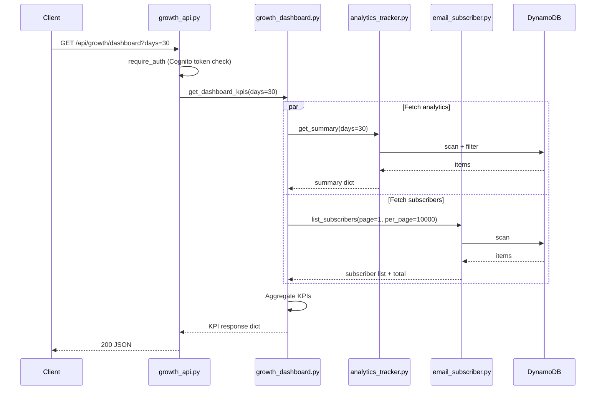
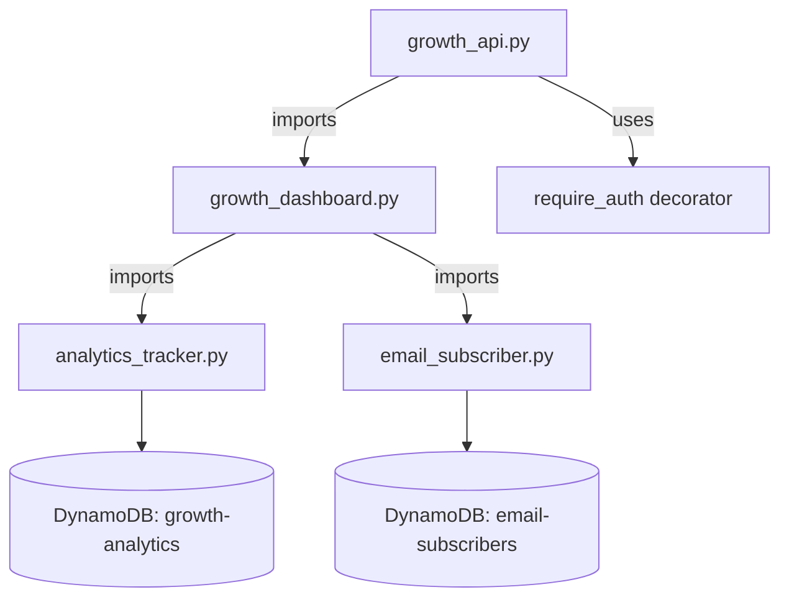

# Design Document: Growth KPI Dashboard

## Overview

The Growth KPI Dashboard provides a single authenticated API endpoint (`GET /api/growth/dashboard`) that aggregates key performance indicators from two existing data sources — the Analytics Tracker (`growth/analytics_tracker.py`) and the Email Subscriber store (`growth/email_subscriber.py`) — into one unified JSON response.

The feature introduces one new module (`growth/growth_dashboard.py`) for aggregation logic, adds one route to the existing `growth/growth_api.py` Blueprint, and ships a documentation file (`docs/GROWTH_DASHBOARD_MODULE.md`). No new tables, no `app.py` changes, no frontend work, and no new dependencies.

### Key Design Decisions

1. **Thin API, fat aggregator** — The endpoint handler in `growth_api.py` only parses the `days` query param and delegates to `get_dashboard_kpis(days)`. All aggregation, error handling, and graceful degradation live in `growth_dashboard.py` so the logic is testable without Flask.
2. **Graceful degradation over hard failure** — If one data source is down, the dashboard still returns `success: true` with zeroed-out fields for the failed source and a boolean flag (`analytics_available` / `subscribers_available`) indicating which source failed.
3. **No new infrastructure** — Reuses existing DynamoDB tables, existing auth decorator, existing Blueprint. Zero environment variables added.

## Architecture



### Module Dependency Graph



## Components and Interfaces

### 1. `growth/growth_dashboard.py` — Dashboard Aggregator (NEW)

Single public function:

```python
def get_dashboard_kpis(days: int = 7) -> dict:
    """Aggregate growth KPIs from analytics and subscriber data sources.
    
    Args:
        days: Lookback window in days. Clamped to [1, 90].
    
    Returns:
        dict with success, all KPI fields, and availability flags.
    """
```

Internal responsibilities:
- Clamp `days` to `[1, 90]`
- Call `analytics_tracker.get_summary(days)` inside a try/except
- Call `email_subscriber.list_subscribers(page=1, per_page=10000)` inside a try/except
- Count new subscribers by filtering `subscribed_at` within the `days` window from current UTC time
- Assemble and return the KPI response dictionary
- Log warnings on individual source failures, errors on unexpected exceptions

### 2. `growth/growth_api.py` — Dashboard Endpoint (MODIFIED)

New route added to existing Blueprint:

```python
@growth_bp.route("/dashboard", methods=["GET"])
@require_auth
def dashboard():
    """GET /api/growth/dashboard — Aggregated growth KPI dashboard.
    
    Query params: days (int, default 7)
    Auth: Bearer token required
    """
```

The handler:
- Parses `days` from query string, defaults to 7 on invalid input
- Calls `get_dashboard_kpis(days)`
- Returns 200 on success, 500 on failure

### 3. `docs/GROWTH_DASHBOARD_MODULE.md` — Documentation (NEW)

Describes the endpoint, response schema, field definitions, and degradation behavior.

## Data Models

### KPI Response Schema

```json
{
  "success": true,
  "days": 30,
  "generated_at": "2026-05-15T14:30:00+00:00",
  "analytics_available": true,
  "subscribers_available": true,
  "total_subscribers": 247,
  "new_subscribers": 38,
  "lead_magnet_downloads": 15,
  "welcome_email_attempted": 42,
  "welcome_email_sent": 40,
  "welcome_email_failed": 2,
  "top_event_types": {
    "page_view": 580,
    "email_signup_completed": 42,
    "lead_magnet_downloaded": 15
  },
  "top_utm_sources": {
    "linkedin": 120,
    "twitter": 45
  },
  "top_utm_campaigns": {
    "launch_2026": 90,
    "starter_kit": 52
  }
}
```

### Field Definitions

| Field | Type | Source | Default (on failure) |
|---|---|---|---|
| `success` | boolean | Aggregator | — |
| `days` | integer | Input (clamped) | — |
| `generated_at` | string (ISO 8601) | `datetime.now(UTC)` | — |
| `analytics_available` | boolean | Aggregator | `false` |
| `subscribers_available` | boolean | Aggregator | `false` |
| `total_subscribers` | integer | `list_subscribers().total` | `0` |
| `new_subscribers` | integer | Computed from `subscribed_at` within `days` window | `0` |
| `lead_magnet_downloads` | integer | `by_type["lead_magnet_downloaded"]` | `0` |
| `welcome_email_attempted` | integer | `by_type["welcome_email_attempted"]` | `0` |
| `welcome_email_sent` | integer | `by_type["welcome_email_sent"]` | `0` |
| `welcome_email_failed` | integer | `by_type["welcome_email_failed"]` | `0` |
| `top_event_types` | dict[str, int] | `by_type` from summary | `{}` |
| `top_utm_sources` | dict[str, int] | `by_utm_source` from summary | `{}` |
| `top_utm_campaigns` | dict[str, int] | `by_utm_campaign` from summary | `{}` |

### Source Data Contracts

**`analytics_tracker.get_summary(days)`** returns:
```python
{
    "success": True,
    "days": 30,
    "total_events": 142,
    "by_type": {"page_view": 80, ...},
    "by_date": {"2026-04-07": 45, ...},
    "by_source": {"website_main": 100, ...},
    "by_utm_source": {"linkedin": 60, ...},
    "by_utm_campaign": {"launch_2026": 90, ...},
}
```

**`email_subscriber.list_subscribers(page, per_page)`** returns:
```python
{
    "success": True,
    "subscribers": [{"email": "...", "subscribed_at": "2026-05-10T...", ...}, ...],
    "total": 247,
    "page": 1,
    "per_page": 10000,
    "pages": 1,
}
```


## Correctness Properties

*A property is a characteristic or behavior that should hold true across all valid executions of a system — essentially, a formal statement about what the system should do. Properties serve as the bridge between human-readable specifications and machine-verifiable correctness guarantees.*

### Property 1: Days parameter clamping

*For any* integer value passed as the `days` parameter, the `days` field in the returned KPI response should always be within the range [1, 90]. Values below 1 should be clamped to 1, values above 90 should be clamped to 90, and values within range should pass through unchanged.

**Validates: Requirements 1.3**

### Property 2: Response schema completeness

*For any* valid call to `get_dashboard_kpis`, the returned dictionary should contain all required top-level keys: `success`, `days`, `generated_at`, `analytics_available`, `subscribers_available`, `total_subscribers`, `new_subscribers`, `lead_magnet_downloads`, `welcome_email_attempted`, `welcome_email_sent`, `welcome_email_failed`, `top_event_types`, `top_utm_sources`, `top_utm_campaigns`.

**Validates: Requirements 1.4, 3.1**

### Property 3: Total subscribers matches source

*For any* subscriber list returned by `list_subscribers`, the `total_subscribers` field in the KPI response should equal the `total` value from the subscriber store response.

**Validates: Requirements 2.1**

### Property 4: New subscribers within date window

*For any* set of subscribers with random `subscribed_at` timestamps and any clamped `days` value, the `new_subscribers` count should equal the number of subscribers whose `subscribed_at` falls within the last `days` calendar days from the current UTC time.

**Validates: Requirements 2.2**

### Property 5: Event type field extraction

*For any* analytics summary with a random `by_type` dictionary, the KPI response fields `lead_magnet_downloads`, `welcome_email_attempted`, `welcome_email_sent`, and `welcome_email_failed` should each equal the corresponding key's value in `by_type` (keys: `lead_magnet_downloaded`, `welcome_email_attempted`, `welcome_email_sent`, `welcome_email_failed`), defaulting to 0 when the key is absent.

**Validates: Requirements 3.2, 3.3, 3.4, 3.5**

### Property 6: Dictionary pass-through from analytics summary

*For any* analytics summary, the KPI response fields `top_event_types`, `top_utm_sources`, and `top_utm_campaigns` should be identical to the `by_type`, `by_utm_source`, and `by_utm_campaign` dictionaries from the summary, respectively.

**Validates: Requirements 3.6, 3.7, 3.8**

### Property 7: Generated timestamp is valid and recent

*For any* call to `get_dashboard_kpis`, the `generated_at` field should be a valid ISO 8601 UTC timestamp that is within 5 seconds of the current UTC time at the moment of the call.

**Validates: Requirements 3.9**

### Property 8: Invalid days query parameter defaults to 7

*For any* non-integer string passed as the `days` query parameter to the API endpoint, the system should use a default value of 7 for the aggregation.

**Validates: Requirements 4.4**

### Property 9: Graceful degradation on data source failure

*For any* failure (exception or `success: false`) from either `get_summary` or `list_subscribers`, the KPI response should still have `success` as `true`, with the failed source's fields set to zero/empty defaults and the corresponding availability flag (`analytics_available` or `subscribers_available`) set to `false`. The non-failed source's data should remain unaffected.

**Validates: Requirements 5.1, 5.2, 5.3**

## Error Handling

### Data Source Failures

Each data source call (`get_summary`, `list_subscribers`) is wrapped in its own try/except block:

- **Analytics failure**: All analytics-derived fields default to zero/empty. `analytics_available` set to `false`. Logged at WARNING level.
- **Subscriber failure**: `total_subscribers` and `new_subscribers` default to 0. `subscribers_available` set to `false`. Logged at WARNING level.
- **Both sources fail**: Response still returns `success: true` with all fields zeroed and both availability flags `false`.

### Unexpected Exceptions

An outer try/except in `get_dashboard_kpis` catches any unexpected error outside the individual source calls:
- Returns `{"success": false, "error": "Dashboard aggregation failed"}`
- Logged at ERROR level

### API Layer Errors

- Invalid `days` query param (non-integer): silently defaults to 7
- Aggregator returns `success: false`: API responds with HTTP 500
- Aggregator returns `success: true`: API responds with HTTP 200

### No New Failure Modes

The dashboard introduces no new failure modes to the system. It only reads from existing data sources and never writes. DynamoDB failures are already handled by the underlying modules.

## Testing Strategy

### Phase 1: Manual Testing Only

Phase 1 does not require any new test dependencies. Validation is done via manual API testing with PowerShell or curl. No `hypothesis` or other external test libraries are needed.

### Manual Test Steps

1. `GET /api/growth/dashboard` with valid auth token → 200 with full KPI response
2. `GET /api/growth/dashboard?days=30` → verify `days: 30` in response
3. `GET /api/growth/dashboard?days=abc` → verify defaults to `days: 7`
4. `GET /api/growth/dashboard?days=0` → verify clamped to `days: 1`
5. `GET /api/growth/dashboard?days=100` → verify clamped to `days: 90`
6. `GET /api/growth/dashboard` without auth token → 401
7. Verify `generated_at` is a valid ISO 8601 timestamp
8. Verify `total_subscribers` and `new_subscribers` are integers ≥ 0
9. Verify `top_event_types`, `top_utm_sources`, `top_utm_campaigns` are dicts
10. If DynamoDB creds are expired, verify graceful degradation (zeroed fields, availability flags false)

### Correctness Properties (Verified Manually)

The 9 correctness properties defined in this design document are verified through the manual test steps above. Automated property-based tests can be added in a future phase if `hypothesis` or similar libraries are introduced to the project.
