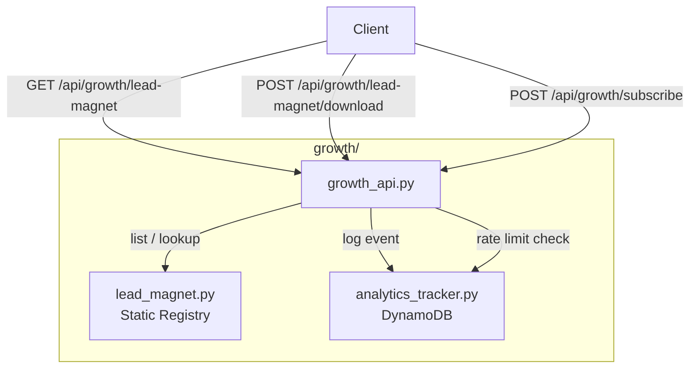

# Design Document: Lead Magnet Delivery System

## Overview

The Lead Magnet Delivery System adds downloadable resource delivery to the ai1stseo.com growth platform. Phase 1 uses a static Python registry (no database) to store lead magnet metadata, two new public endpoints on the existing `growth_bp` Flask Blueprint, and integration with the existing analytics tracker and subscribe flow.

### Goals
- Serve a catalog of lead magnets via `GET /api/growth/lead-magnet`
- Return download URLs and log analytics via `POST /api/growth/lead-magnet/download`
- Optionally attach a lead magnet link to the subscribe response when `lead_magnet_slug` is provided
- Add `lead_magnet_downloaded` to the analytics tracker's allowed event types
- Reuse existing rate limiting from `analytics_tracker._check_rate_limit()`
- Create developer documentation at `docs/LEAD_MAGNET_MODULE.md`

### Non-Goals
- No app.py changes
- No new DynamoDB tables
- No email sending (SES)
- No frontend UI
- No file uploads
- No authentication on lead magnet endpoints (Phase 1)

## Architecture

### High-Level Flow



### Request Flows

**List lead magnets:**
```
GET /api/growth/lead-magnet
  → growth_api.lead_magnet_list()
    → lead_magnet.get_lead_magnets()
    ← JSON list of valid lead magnets
  ← 200 {success, lead_magnets, count}
```

**Download (log + return URL):**
```
POST /api/growth/lead-magnet/download  {slug, session_id?}
  → growth_api.lead_magnet_download()
    → validate slug present → 400 if missing
    → lead_magnet.get_lead_magnet_by_slug(slug) → 404 if not found
    → if session_id: analytics_tracker._check_rate_limit(session_id) → 429 if exceeded
    → else: logger.warning("download without session_id")
    → analytics_tracker.track_event("lead_magnet_downloaded", event_data={slug, id}, session_id=session_id)
    ← 200 {success, download_url, title, slug}
```

**Subscribe with lead magnet:**
```
POST /api/growth/subscribe  {email, ..., lead_magnet_slug?}
  → existing subscribe logic (unchanged)
  → if lead_magnet_slug:
      → lead_magnet.get_lead_magnet_by_slug(lead_magnet_slug)
      → if found: attach lead_magnet object to response, track "lead_magnet_clicked" event
      → if not found: ignore, return normal subscribe response
  ← 201 {success, subscriber, lead_magnet?}
```

## Components and Interfaces

### Files to Create

| File | Purpose |
|------|---------|
| `growth/lead_magnet.py` | Static registry, validation, lookup functions |
| `docs/LEAD_MAGNET_MODULE.md` | Developer documentation |

### Files to Modify

| File | Change |
|------|--------|
| `growth/growth_api.py` | Add 2 new endpoints, modify `subscribe()` |
| `growth/analytics_tracker.py` | Ensure both `"lead_magnet_clicked"` and `"lead_magnet_downloaded"` are in `ALLOWED_EVENT_TYPES` (add `"lead_magnet_downloaded"`) |

### No Changes To

| File | Reason |
|------|--------|
| `app.py` | Constraint: no app.py changes |
| `growth/email_subscriber.py` | Subscribe logic stays in growth_api.py |
| `growth/utm_manager.py` | No UTM changes needed |
| `growth/social_scheduler_dynamo.py` | Unrelated module |

---

### `growth/lead_magnet.py` — Function Signatures

```python
"""
growth/lead_magnet.py
Lead Magnet Registry — static metadata store for Phase 1.

Stores lead magnet definitions as a Python list of dicts.
Provides lookup and validation functions. No database, no external deps.

Integration points:
  - growth/growth_api.py calls get_lead_magnets() and get_lead_magnet_by_slug()
  - growth/analytics_tracker.py logs lead_magnet_downloaded / lead_magnet_clicked events
"""

# Static registry — list of dicts
_LEAD_MAGNETS: list[dict] = [
    {
        "id": "lm-001",
        "slug": "seo-starter-checklist",
        "title": "SEO Starter Checklist",
        "description": "A 20-point checklist to launch your first SEO campaign.",
        "download_url": "https://assets.ai1stseo.com/lead-magnets/seo-starter-checklist.pdf",
    },
]

def validate_lead_magnet(entry: dict) -> bool:
    """Validate a single lead magnet entry.
    
    Checks: all required fields non-empty, download_url starts with https://.
    Returns True if valid, False otherwise.
    """

def get_lead_magnets() -> list[dict]:
    """Return all valid lead magnet entries from the registry.
    
    Invalid entries are excluded and logged as warnings.
    """

def get_lead_magnet_by_slug(slug: str) -> dict | None:
    """Return a single lead magnet matching the given slug (case-insensitive).
    
    Returns None if not found.
    """

def _check_unique_ids(magnets: list[dict]) -> list[dict]:
    """Filter out entries with duplicate IDs, keeping the first occurrence.
    
    Logs a warning for each duplicate.
    """
```

### `growth/growth_api.py` — New Endpoints

```python
# --- New endpoint: GET /api/growth/lead-magnet ---

@growth_bp.route("/lead-magnet", methods=["GET"])
def lead_magnet_list():
    """List all available lead magnets. Public, no auth."""
    # → lead_magnet.get_lead_magnets()
    # ← 200 {success: true, lead_magnets: [...], count: N}

# --- New endpoint: POST /api/growth/lead-magnet/download ---

@growth_bp.route("/lead-magnet/download", methods=["POST"])
def lead_magnet_download():
    """Log a download event and return the download URL. Public, no auth.
    
    Request JSON: {slug: str, session_id?: str}
    """
    # 1. Validate slug present → 400
    # 2. Lookup by slug → 404
    # 3. Rate limit if session_id → 429
    # 4. Track "lead_magnet_downloaded" event
    # 5. Return {success, download_url, title, slug}
```

### `growth/growth_api.py` — Modified `subscribe()` Endpoint

```python
# Inside existing subscribe() function, AFTER the successful add_subscriber call:

# --- New logic appended to subscribe() ---
lead_magnet_slug = data.get("lead_magnet_slug")
if lead_magnet_slug and result.get("success"):
    from growth.lead_magnet import get_lead_magnet_by_slug
    lm = get_lead_magnet_by_slug(lead_magnet_slug)
    if lm:
        result["lead_magnet"] = {
            "id": lm["id"],
            "title": lm["title"],
            "slug": lm["slug"],
            "download_url": lm["download_url"],
        }
        # Track lead_magnet_clicked event (non-blocking)
        try:
            from growth.analytics_tracker import track_event
            track_event(
                event_type="lead_magnet_clicked",
                event_data={"slug": lm["slug"], "id": lm["id"]},
            )
        except Exception:
            pass
```

### `growth/analytics_tracker.py` — Change

Add `"lead_magnet_downloaded"` to the `ALLOWED_EVENT_TYPES` frozenset. Verify `"lead_magnet_clicked"` is already present (it is). Both event types are required:

- `lead_magnet_clicked` — tracked when a lead magnet link is returned after successful subscription
- `lead_magnet_downloaded` — tracked when a user hits the download endpoint

```python
ALLOWED_EVENT_TYPES = frozenset([
    "page_view",
    "email_signup_started",
    "email_signup_completed",
    "lead_magnet_clicked",       # already present — used by subscribe flow
    "lead_magnet_downloaded",    # ← NEW — used by download endpoint
    "newsletter_cta_clicked",
    "subscriber_exported",
    "subscriber_list_viewed",
])
```

## Data Models

### Lead Magnet Registry Entry

```python
{
    "id": "lm-001",                # str — unique, immutable primary key
    "slug": "seo-starter-checklist",  # str — human-readable, URL-safe identifier
    "title": "SEO Starter Checklist", # str — display name
    "description": "A 20-point checklist to launch your first SEO campaign.",  # str
    "download_url": "https://assets.ai1stseo.com/lead-magnets/seo-starter-checklist.pdf",  # str — must start with https://
}
```

**Constraints:**
- `id`: non-empty string, unique across all entries, immutable once assigned
- `slug`: non-empty string, compared case-insensitively (normalized to lowercase)
- `title`: non-empty string
- `description`: non-empty string
- `download_url`: non-empty string, must start with `https://`

### API Response Shapes

**GET /api/growth/lead-magnet — 200:**
```json
{
    "success": true,
    "lead_magnets": [
        {
            "id": "lm-001",
            "slug": "seo-starter-checklist",
            "title": "SEO Starter Checklist",
            "description": "A 20-point checklist to launch your first SEO campaign.",
            "download_url": "https://assets.ai1stseo.com/lead-magnets/seo-starter-checklist.pdf"
        }
    ],
    "count": 1
}
```

**POST /api/growth/lead-magnet/download — 200:**
```json
{
    "success": true,
    "download_url": "https://assets.ai1stseo.com/lead-magnets/seo-starter-checklist.pdf",
    "title": "SEO Starter Checklist",
    "slug": "seo-starter-checklist"
}
```

**POST /api/growth/lead-magnet/download — 400 (missing slug):**
```json
{"success": false, "error": "slug is required"}
```

**POST /api/growth/lead-magnet/download — 404 (unknown slug):**
```json
{"success": false, "error": "Lead magnet not found"}
```

**POST /api/growth/lead-magnet/download — 429 (rate limited):**
```json
{"success": false, "error": "Rate limit exceeded"}
```

**POST /api/growth/subscribe — 201 (with lead magnet):**
```json
{
    "success": true,
    "subscriber": {"id": "...", "email": "...", "subscribed_at": "..."},
    "lead_magnet": {
        "id": "lm-001",
        "title": "SEO Starter Checklist",
        "slug": "seo-starter-checklist",
        "download_url": "https://assets.ai1stseo.com/lead-magnets/seo-starter-checklist.pdf"
    }
}
```

### Analytics Event Data (stored in DynamoDB `event_data` field)

For `lead_magnet_downloaded` and `lead_magnet_clicked` events:
```json
{
    "slug": "seo-starter-checklist",
    "id": "lm-001"
}
```


## Correctness Properties

*A property is a characteristic or behavior that should hold true across all valid executions of a system — essentially, a formal statement about what the system should do. Properties serve as the bridge between human-readable specifications and machine-verifiable correctness guarantees.*

### Property 1: Validation filter excludes invalid entries

*For any* list of lead magnet entries, `get_lead_magnets()` should return only entries where all five required fields (`id`, `slug`, `title`, `description`, `download_url`) are non-empty strings AND `download_url` starts with `https://`. Any entry failing these checks should be excluded from the result.

**Validates: Requirements 1.1, 1.2, 6.1, 6.2, 6.3**

### Property 2: Unique ID deduplication

*For any* list of lead magnet entries containing duplicate `id` values, `get_lead_magnets()` should return at most one entry per unique `id`, keeping the first occurrence and discarding later duplicates.

**Validates: Requirements 6.4**

### Property 3: Slug lookup is case-insensitive and correct

*For any* valid lead magnet in the registry and any case variation of its slug, `get_lead_magnet_by_slug(slug_variant)` should return the same lead magnet entry. For any slug not matching any entry (case-insensitively), it should return `None`.

**Validates: Requirements 7.3, 7.4**

### Property 4: Download returns correct data for valid slugs

*For any* valid slug in the registry, `POST /api/growth/lead-magnet/download` with that slug should return a 200 response containing the matching `download_url`, `title`, and `slug` fields from the registry entry.

**Validates: Requirements 2.1, 2.5**

### Property 5: Download logs analytics event with correct data

*For any* valid slug and optional session_id, when `POST /api/growth/lead-magnet/download` succeeds, the system should call `track_event` with `event_type="lead_magnet_downloaded"`, `event_data` containing the lead magnet's `slug` and `id`, and the provided `session_id`.

**Validates: Requirements 2.2, 3.6, 4.3**

### Property 6: Unknown slug returns 404

*For any* slug string that does not match any entry in the registry (case-insensitively), `POST /api/growth/lead-magnet/download` should return HTTP 404 with `{"success": false, "error": "Lead magnet not found"}`.

**Validates: Requirements 2.3**

### Property 7: Rate limiting enforced after threshold

*For any* session_id, after 20 successful download requests within a 60-second window, the next request with the same session_id should return HTTP 429 with `{"success": false, "error": "Rate limit exceeded"}` and should NOT include a `download_url` in the response.

**Validates: Requirements 3.2, 3.3**

### Property 8: Subscribe with valid slug returns lead magnet

*For any* valid email and valid lead magnet slug, `POST /api/growth/subscribe` should include a `lead_magnet` object in the success response containing the matching `id`, `title`, `slug`, and `download_url`.

**Validates: Requirements 5.1**

### Property 9: Subscribe with invalid slug omits lead magnet

*For any* valid email and slug string that does not match any registry entry, `POST /api/growth/subscribe` should complete the subscription successfully without a `lead_magnet` key in the response.

**Validates: Requirements 5.2**

### Property 10: Subscribe with valid slug tracks clicked event

*For any* valid email and valid lead magnet slug, when `POST /api/growth/subscribe` returns a `lead_magnet` object, the system should call `track_event` with `event_type="lead_magnet_clicked"` and `event_data` containing the lead magnet's `slug` and `id`.

**Validates: Requirements 5.4**

## Error Handling

### Endpoint Error Responses

| Scenario | HTTP Status | Response Body |
|----------|-------------|---------------|
| Missing `slug` on download | 400 | `{"success": false, "error": "slug is required"}` |
| Unknown `slug` on download | 404 | `{"success": false, "error": "Lead magnet not found"}` |
| Rate limit exceeded | 429 | `{"success": false, "error": "Rate limit exceeded"}` |
| Analytics tracker failure | — | Non-blocking: log warning, still return download URL |
| Invalid registry entry | — | Excluded from responses, logged as warning at module load |

### Error Handling Strategy

- **Analytics failures are non-blocking**: If `track_event()` raises an exception during download or subscribe, the primary operation (returning the URL or completing the subscription) still succeeds. Errors are caught and logged.
- **Validation failures are silent exclusions**: Invalid registry entries are filtered out at read time by `get_lead_magnets()`. A `logger.warning` is emitted for each invalid entry so developers notice during development.
- **Rate limit is best-effort**: The in-memory rate limiter (reused from `analytics_tracker._check_rate_limit`) resets on process restart. It's a dev safety guard, not a production security measure.
- **No 500 errors from lead magnet module**: Since the registry is static Python data (no DB, no network), the only failure modes are programming errors. The validation layer ensures malformed data doesn't reach the API response.

### Isolation Strategy

- All new code lives in `growth/lead_magnet.py` — no changes to `app.py` or any module outside `growth/`
- The only modification to existing files: `ALLOWED_EVENT_TYPES` in `analytics_tracker.py` (ensure both `lead_magnet_clicked` and `lead_magnet_downloaded` are present), and endpoint additions + subscribe modification in `growth_api.py`
- `lead_magnet.py` has zero external dependencies (no boto3, no Flask) — pure Python functions operating on a static list
- The subscribe endpoint modification is additive only — existing behavior is unchanged when `lead_magnet_slug` is absent

### Risks and Conflicts

| Risk | Mitigation |
|------|------------|
| Modifying `subscribe()` could break existing behavior | Change is additive: only runs when `lead_magnet_slug` is present AND subscription succeeds |
| Adding to `ALLOWED_EVENT_TYPES` could conflict with other PRs | Single-line change, easy to merge |
| Rate limiter state shared between download and track endpoints | Both use the same `_check_rate_limit` with the same session_id — this is intentional and consistent |
| Static registry doesn't scale | Phase 1 constraint; Phase 2 can migrate to DynamoDB without API changes |

## Testing Strategy

### Property-Based Testing

**Library**: [Hypothesis](https://hypothesis.readthedocs.io/) (Python PBT library)

**Configuration**: Each property test runs a minimum of 100 iterations.

**Tag format**: Each test includes a comment: `# Feature: lead-magnet-delivery, Property {N}: {title}`

Each correctness property (1–10) maps to a single property-based test:

| Property | Test Description | Generator Strategy |
|----------|------------------|--------------------|
| 1 | Generate random dicts with optional missing/empty fields and non-https URLs; verify `get_lead_magnets()` filters correctly | `st.fixed_dictionaries` with `st.one_of(st.text(), st.just(""))` for each field |
| 2 | Generate lists with duplicate IDs; verify only first occurrence kept | `st.lists(st.fixed_dictionaries(...))` with forced duplicate IDs |
| 3 | Generate valid slugs, apply random case transforms; verify lookup consistency | `st.text()` mapped through `.upper()`, `.lower()`, `.title()` |
| 4 | Generate valid registry entries, pick random slug; verify download response fields match | `st.sampled_from(registry)` |
| 5 | Generate valid slugs + optional session_ids; verify `track_event` called with correct args | Mock `track_event`, assert call args |
| 6 | Generate random strings not in registry; verify 404 | `st.text().filter(lambda s: s.lower() not in known_slugs)` |
| 7 | Fix a session_id, call download 21 times; verify 21st returns 429 | Deterministic loop with Hypothesis-generated session_id |
| 8 | Generate valid emails + valid slugs; verify subscribe response contains `lead_magnet` | `st.emails()` + `st.sampled_from(valid_slugs)` |
| 9 | Generate valid emails + non-matching slugs; verify no `lead_magnet` in response | `st.emails()` + `st.text().filter(...)` |
| 10 | Generate valid emails + valid slugs; verify `track_event` called with `lead_magnet_clicked` | Mock `track_event`, assert call args |

### Unit Tests

Unit tests complement property tests for specific examples and edge cases:

- **Empty registry**: `get_lead_magnets()` returns `[]`, list endpoint returns `{"success": true, "lead_magnets": [], "count": 0}`
- **Missing slug on download**: POST without slug → 400
- **No session_id on download**: Request succeeds, logger.warning emitted
- **Subscribe without lead_magnet_slug**: Normal subscribe response, no `lead_magnet` key
- **`lead_magnet_downloaded` in ALLOWED_EVENT_TYPES**: Membership check
- **`lead_magnet_clicked` in ALLOWED_EVENT_TYPES**: Membership check (already present)
- **Analytics failure during download**: Mock `track_event` to raise, verify download still returns URL
- **Analytics failure during subscribe**: Mock `track_event` to raise, verify subscribe still succeeds

### Test File Location

- `tests/test_lead_magnet.py` — unit tests for `growth/lead_magnet.py` functions
- `tests/test_lead_magnet_api.py` — integration tests for the API endpoints
- `tests/test_lead_magnet_properties.py` — Hypothesis property-based tests
