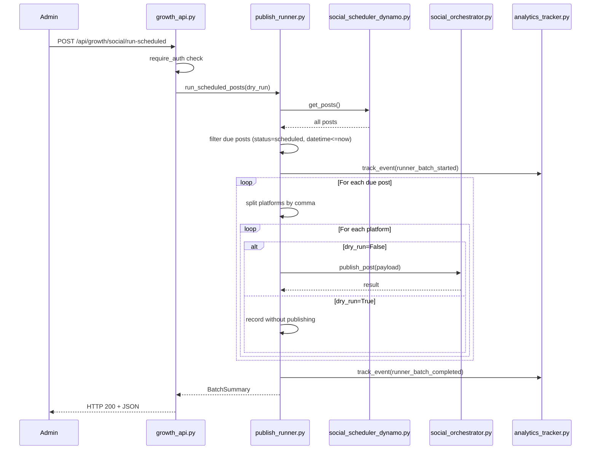

# Design Document — Scheduled Publishing Runner

## Overview

The Scheduled Publishing Runner is a new module (`growth/publish_runner.py`) that batch-publishes overdue social media posts. It scans the existing `ai1stseo-social-posts` DynamoDB table for posts with `status == "scheduled"` whose `scheduled_datetime` has passed, splits multi-platform posts into individual calls, and routes each through the existing `social_orchestrator.publish_post()`. A manual HTTP trigger endpoint (`POST /api/growth/social/run-scheduled`) is added to `growth_api.py`. An optional dry-run mode previews what would be published without side effects. Two new analytics event types (`runner_batch_started`, `runner_batch_completed`) are registered for monitoring.

No new dependencies, no new DynamoDB tables, no changes to `app.py`, no background workers.

## Architecture



The Runner sits between the API layer and the existing Orchestrator. It adds batch-level coordination (fetching, filtering, splitting, summarizing) while delegating all publish logic to the Orchestrator. This avoids duplicating provider selection, status updates, or per-publish analytics.

## Components and Interfaces

### 1. `growth/publish_runner.py` — New Module

Single public function:

```python
def run_scheduled_posts(dry_run: bool = False) -> dict:
    """
    Fetch all posts, filter to due posts, split platforms, publish each.
    
    Returns BatchSummary dict:
    {
        "success": True,
        "dry_run": bool,
        "total_due": int,
        "total_publish_attempts": int,
        "succeeded": int,
        "failed": int,
        "skipped": int,
        "results": [
            {"post_id": str, "platform": str, "success": bool|None, "error": str|None},
            ...
        ]
    }
    """
```

Internal helpers (private):
- `_get_due_posts() -> tuple[list[dict], list[dict]]` — calls `get_posts()`, filters by status and datetime, returns `(due_posts, skipped_entries)` where skipped entries are posts with parse errors or missing platforms.
- `_split_platforms(post: dict) -> list[str]` — splits the `platforms` comma-separated string, trims whitespace, returns list of lowercased platform names.
- `_build_payload(post: dict, platform: str) -> dict` — constructs the payload dict for `publish_post()`.

### 2. `growth/growth_api.py` — New Endpoint

```python
@growth_bp.route("/social/run-scheduled", methods=["POST"])
@require_auth
def social_run_scheduled():
    """POST /api/growth/social/run-scheduled — Trigger batch publish. Auth required."""
```

- Reads `dry_run` from JSON body (defaults to `False`).
- Calls `run_scheduled_posts(dry_run=dry_run)`.
- Returns HTTP 200 with BatchSummary on success.
- Returns HTTP 500 with `{"success": false, "error": "..."}` on unhandled exception.

### 3. `growth/analytics_tracker.py` — Event Type Registration

Add two entries to `ALLOWED_EVENT_TYPES`:
- `"runner_batch_started"`
- `"runner_batch_completed"`

No other changes to the analytics module.

### 4. `docs/PUBLISH_RUNNER_MODULE.md` — Documentation

Markdown doc covering: purpose, endpoint usage, dry-run mode, batch summary format, and example curl commands.

## Data Models

### BatchSummary (returned by `run_scheduled_posts`)

| Field | Type | Description |
|---|---|---|
| `success` | `bool` | Always `True` when the runner completes (even if individual publishes fail) |
| `dry_run` | `bool` | Whether this was a dry-run invocation |
| `total_due` | `int` | Number of due posts found |
| `total_publish_attempts` | `int` | Number of individual platform publish calls attempted |
| `succeeded` | `int` | Count of successful publishes |
| `failed` | `int` | Count of failed publishes |
| `skipped` | `int` | Count of skipped entries (parse errors, missing platforms) |
| `results` | `list[ResultEntry]` | Per-platform result details |

### ResultEntry

| Field | Type | Description |
|---|---|---|
| `post_id` | `str` | The post ID from DynamoDB |
| `platform` | `str` | The individual platform name (lowercased, trimmed) |
| `success` | `bool \| None` | `True`/`False` for normal mode, `None` for dry-run |
| `error` | `str \| None` | Error message on failure, `None` otherwise |

### Existing Post Item (from `social_scheduler_dynamo`)

Relevant fields consumed by the Runner:

| Field | Type | Example |
|---|---|---|
| `post_id` | `str` | `"a1b2c3d4e5f6"` |
| `content` | `str` | `"Check out our new feature..."` |
| `platforms` | `str` | `"LinkedIn, X"` |
| `scheduled_datetime` | `str` | `"2026-04-10 14:30"` |
| `status` | `str` | `"scheduled"` |

### Analytics Event Payloads

`runner_batch_started`:
```json
{"dry_run": true, "total_due": 5}
```

`runner_batch_completed`:
```json
{"dry_run": true, "total_due": 5, "succeeded": 3, "failed": 1, "skipped": 1}
```


## Correctness Properties

*A property is a characteristic or behavior that should hold true across all valid executions of a system — essentially, a formal statement about what the system should do. Properties serve as the bridge between human-readable specifications and machine-verifiable correctness guarantees.*

### Property 1: Due post filtering

*For any* set of posts returned by `get_posts()`, the Runner should include in its due list only those posts where `status == "scheduled"` and `scheduled_datetime` (parsed as `"YYYY-MM-DD HH:MM"` UTC) is less than or equal to the current UTC time. Posts with unparseable datetimes should be excluded from the due list and counted as skipped.

**Validates: Requirements 1.2, 1.3, 1.4**

### Property 2: Platform splitting produces correct count

*For any* comma-separated platform string (e.g. `"LinkedIn, X, Instagram"`), splitting by comma and trimming whitespace should produce a list whose length equals the number of comma-separated segments, and each entry should be the lowercased, trimmed version of the original segment.

**Validates: Requirements 2.1, 2.2**

### Property 3: Publish payload construction

*For any* due post and any platform derived from its platform string, the payload passed to `publish_post()` should contain `post_id` equal to the post's `post_id`, `content` equal to the post's `content`, `platform` equal to the lowercased trimmed platform name, and `scheduled_at` equal to the post's `scheduled_datetime`.

**Validates: Requirements 3.1**

### Property 4: All platform entries produce results

*For any* set of due posts with any mix of orchestrator success/failure outcomes, the `results` list in the BatchSummary should contain exactly one entry per platform entry across all due posts, and the total number of results should equal `total_publish_attempts`.

**Validates: Requirements 3.2, 3.3**

### Property 5: Batch summary counts are consistent

*For any* completed runner invocation, the BatchSummary should contain all required fields (`success`, `dry_run`, `total_due`, `total_publish_attempts`, `succeeded`, `failed`, `skipped`, `results`), and `succeeded + failed` should equal `total_publish_attempts`, and each result entry should contain `post_id`, `platform`, `success`, and `error`.

**Validates: Requirements 4.1, 4.2**

### Property 6: Top-level success is always true on completion

*For any* set of posts with any mix of individual publish outcomes (all succeed, all fail, mixed), the top-level `success` field in the BatchSummary should be `True` when the runner completes without raising an unhandled exception.

**Validates: Requirements 4.3**

### Property 7: Dry-run produces no side effects

*For any* set of due posts, when the Runner is invoked with `dry_run=True`, the orchestrator's `publish_post()` should not be called, and no post statuses should be modified in the Scheduler_Table.

**Validates: Requirements 5.1, 5.3**

### Property 8: Dry-run result entries have null success and error

*For any* due post in dry-run mode, every result entry in the BatchSummary should have `success` set to `None` and `error` set to `None`.

**Validates: Requirements 5.2**

### Property 9: Analytics events contain correct data

*For any* runner invocation, a `runner_batch_started` event should be tracked with `event_data` containing `dry_run` (bool) and `total_due` (int), and a `runner_batch_completed` event should be tracked with `event_data` containing `dry_run`, `total_due`, `succeeded`, `failed`, and `skipped` — where the completed event's counts match the BatchSummary.

**Validates: Requirements 7.1, 7.2**

## Error Handling

| Scenario | Handling | User Impact |
|---|---|---|
| `get_posts()` raises exception | Runner propagates to endpoint; endpoint returns HTTP 500 with JSON error | Admin sees error, no posts processed |
| `scheduled_datetime` unparseable | Post skipped, parse-error entry added to `results` with `success=False` and descriptive error, `skipped` count incremented | Admin sees which posts had bad dates |
| Empty/missing `platforms` field | Post skipped, missing-platform entry added to `results` with `success=False`, `skipped` count incremented | Admin sees which posts lacked platforms |
| `publish_post()` raises exception for one platform | Exception caught, result recorded as failed, processing continues to next platform/post | One failure doesn't block the batch |
| `publish_post()` returns `success=False` | Result recorded as failed with error message from orchestrator, processing continues | Admin sees per-platform failure details |
| `track_event()` fails | Exception caught and logged, runner continues — analytics is non-blocking | No user impact, logged for debugging |
| Auth token missing/invalid on endpoint | `require_auth` returns HTTP 401 before runner is invoked | Unauthenticated request rejected |

Design decisions:
- Analytics tracking is wrapped in try/except so tracker failures never abort a batch run.
- The runner catches exceptions per-platform-entry, not per-post, so a failure on one platform of a multi-platform post doesn't skip the remaining platforms.
- The `skipped` count covers both parse errors and missing platforms — these are distinct from `failed` (which means the orchestrator was called and returned failure or raised).

## Testing Strategy

### Phase 1: Manual Testing Only

Phase 1 does not require any new test dependencies. Validation is done via manual API testing with PowerShell or curl. No `hypothesis` or other external test libraries are needed.

### Manual Test Steps

1. `POST /api/growth/social/run-scheduled` without auth → 401
2. `POST /api/growth/social/run-scheduled` with auth and `{"dry_run": true}` → 200 with batch summary, no posts actually published
3. `POST /api/growth/social/run-scheduled` with auth and `{}` or `{"dry_run": false}` → 200 with batch summary, due posts published
4. Create a scheduled post with past datetime, run the runner → verify it gets picked up and published
5. Create a scheduled post with future datetime → verify it's NOT picked up
6. Create a post with `status: "draft"` → verify it's NOT picked up
7. Create a multi-platform post (e.g. "LinkedIn, X") → verify separate results per platform
8. Verify `runner_batch_started` and `runner_batch_completed` in ALLOWED_EVENT_TYPES
9. If no publisher configured → verify posts show as failed with "No publisher configured"

### Correctness Properties (Verified Manually)

The 9 correctness properties defined in this design document are verified through the manual test steps above. Automated property-based tests can be added in a future phase if `hypothesis` or similar libraries are introduced to the project.
