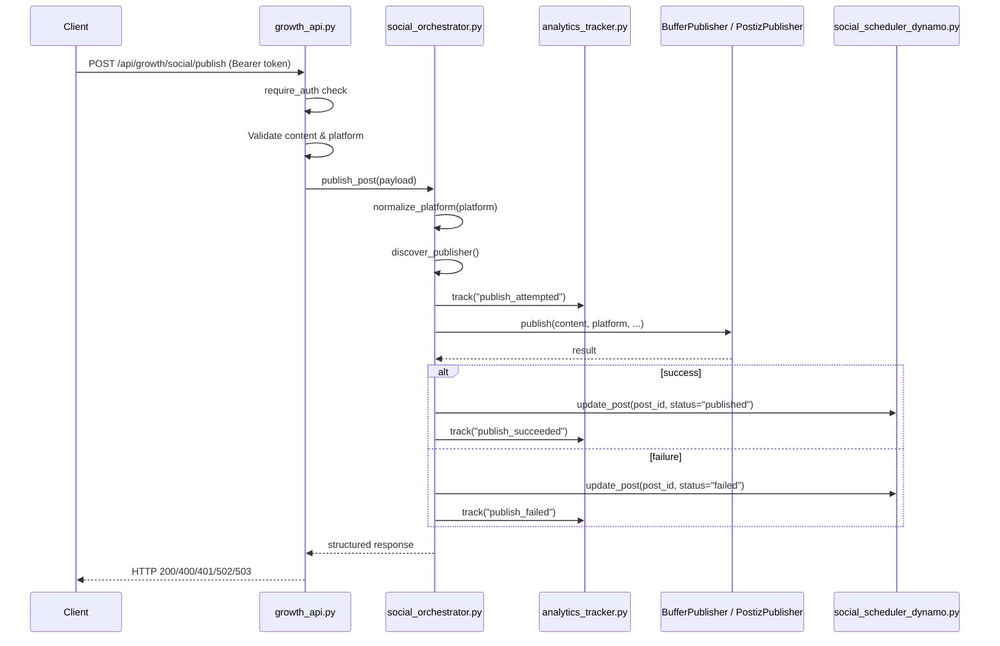

# Design Document: Social Publish Orchestrator

## Overview

The Social Publish Orchestrator adds a thin orchestration layer (`growth/social_orchestrator.py`) that bridges the existing social post scheduler with the two configured publishers (`BufferPublisher` and `PostizPublisher`). It exposes a single authenticated REST endpoint (`POST /api/growth/social/publish`) that accepts a normalized payload, discovers which publisher has valid credentials, normalizes the platform name, routes the request, updates the post status in DynamoDB, and tracks lifecycle events via the analytics tracker.

The design is strictly additive: no changes to `app.py`, no new DynamoDB tables, and no modifications to the existing publisher modules. The orchestrator imports and instantiates publishers as-is, delegating all platform-specific API logic to them.



## Architecture

### Module Layout

All new code lives in two existing files plus one new file:

| File | Change Type | Purpose |
|------|-------------|---------|
| `growth/social_orchestrator.py` | **New** | Publisher discovery, platform normalization, routing, result formatting |
| `growth/growth_api.py` | **Additive** | New `POST /api/growth/social/publish` endpoint |
| `growth/analytics_tracker.py` | **Additive** | Three new strings in `ALLOWED_EVENT_TYPES` |
| `docs/SOCIAL_ORCHESTRATOR_MODULE.md` | **New** | Developer documentation |

### Design Decisions

1. **Single-function entry point**: `publish_post(payload)` in `social_orchestrator.py` is the sole public function. It handles the full lifecycle (normalize → discover → track → publish → update → track). This keeps the API layer thin.

2. **Publisher instantiation on each call**: The orchestrator creates fresh `BufferPublisher()` and `PostizPublisher()` instances per call rather than using module-level singletons. This ensures credential changes (env var updates) take effect without restart, and avoids shared mutable state.

3. **Buffer-preferred default**: When both publishers are configured, Buffer is selected unless `SOCIAL_PUBLISHER_PREFERENCE=postiz`. This matches the existing project convention where Buffer is the primary publisher.

4. **Platform normalization in orchestrator**: The orchestrator normalizes platform names before passing to publishers. Even though both publishers have their own internal platform maps, normalizing early ensures consistent analytics tracking and error messages regardless of which publisher is selected.

5. **Fire-and-forget analytics/status updates**: Analytics tracking and post status updates are wrapped in try/except. Failures are logged but never block the publish response. This prevents secondary system failures from masking a successful publish.

6. **No modifications to publisher modules**: Both `buffer_publisher.py` and `postiz_publisher.py` are imported and used as-is. The orchestrator adapts to their existing `publish()` signatures.

## Components and Interfaces

### 1. `growth/social_orchestrator.py`

```python
# --- Constants ---
CANONICAL_PLATFORMS = {"linkedin", "x", "instagram", "facebook"}
PLATFORM_ALIASES = {"twitter": "x", "twitter/x": "x"}

# --- Public function ---
def publish_post(payload: dict) -> dict:
    """
    Orchestrate a social media publish request.

    Args:
        payload: {
            "post_id": str | None,      # Optional scheduler post ID
            "content": str,              # Post text (required)
            "platform": str,             # Platform name (required)
            "scheduled_at": str | None,  # ISO datetime for scheduling
        }

    Returns:
        {
            "success": bool,
            "provider": str | None,      # "buffer" or "postiz" or None
            "result": dict | None,       # Publisher response on success
            "error": str | None,         # Error message on failure
            "status": str | None,        # e.g. "provider_unavailable"
        }
    """

# --- Internal helpers ---
def normalize_platform(raw: str) -> tuple[str | None, str | None]:
    """
    Normalize platform input to canonical value.

    Returns:
        (canonical_platform, error_message)
        One of the two will be None.
    """

def discover_publisher() -> tuple[object | None, str | None]:
    """
    Discover which publisher to use based on credentials and preference.

    Returns:
        (publisher_instance, provider_name) or (None, None)
    """
```

### 2. `growth/growth_api.py` — New Endpoint

```python
@growth_bp.route("/social/publish", methods=["POST"])
@require_auth
def social_publish():
    """POST /api/growth/social/publish — Publish a post via orchestrator.

    Requires: Authorization: Bearer <cognito_token>
    Body: {"content": "...", "platform": "...", "post_id": "...", "scheduled_at": "..."}
    """
```

The endpoint performs input validation (content required, platform required), delegates to `publish_post()`, and maps the orchestrator result to the appropriate HTTP status code:

| Orchestrator Result | HTTP Status |
|---|---|
| `success=True` | 200 |
| Missing content/platform | 400 |
| No configured provider | 503 |
| Publisher error | 502 |

### 3. `growth/analytics_tracker.py` — Event Types

Three new strings added to `ALLOWED_EVENT_TYPES`:

```python
"publish_attempted"
"publish_succeeded"
"publish_failed"
```

No other changes to the module. The existing `track_event()` function is called by the orchestrator with appropriate `event_data`.

### 4. Publisher Interface (consumed, not modified)

Both publishers expose the same interface the orchestrator relies on:

```python
class BufferPublisher:
    configured: bool  # property
    def publish(self, text, platform=None, channel_id=None,
                due_at=None, image_url=None, dry_run=False) -> dict

class PostizPublisher:
    configured: bool  # property
    def publish(self, content, platform, integration_id=None,
                scheduled_at=None, images=None, dry_run=False) -> dict
```

Note the slight signature differences: Buffer uses `text` + `due_at`, Postiz uses `content` + `scheduled_at`. The orchestrator adapts the call based on which publisher is selected.

## Data Models

### Publish Payload (Input)

```json
{
    "post_id": "abc123",
    "content": "Check out our new AI SEO tool! #AISEO",
    "platform": "linkedin",
    "scheduled_at": "2026-04-15T14:00:00Z"
}
```

| Field | Type | Required | Description |
|-------|------|----------|-------------|
| `content` | string | Yes | Post text/caption |
| `platform` | string | Yes | Target platform (canonical or alias) |
| `post_id` | string | No | Scheduler post ID for status update |
| `scheduled_at` | string | No | ISO 8601 datetime for scheduling |

### Orchestrator Response (Output)

Success:
```json
{
    "success": true,
    "provider": "buffer",
    "result": { "post": { "id": "buf_123", "text": "..." } },
    "error": null
}
```

Failure (no provider):
```json
{
    "success": false,
    "provider": null,
    "error": "No publisher configured",
    "status": "provider_unavailable"
}
```

Failure (publisher error):
```json
{
    "success": false,
    "provider": "buffer",
    "error": "No channel ID for 'linkedin'. Set BUFFER_CHANNEL_LI env var or pass channel_id.",
    "result": null
}
```

### Platform Normalization Map

| Input (case-insensitive, trimmed) | Canonical Output |
|---|---|
| `linkedin` | `linkedin` |
| `x` | `x` |
| `twitter` | `x` |
| `twitter/x` | `x` |
| `instagram` | `instagram` |
| `facebook` | `facebook` |

### Analytics Event Data

| Event Type | `event_data` Fields |
|---|---|
| `publish_attempted` | `platform`, `provider` |
| `publish_succeeded` | `platform`, `provider`, `post_id` |
| `publish_failed` | `platform`, `provider`, `post_id`, `error` |


## Correctness Properties

*A property is a characteristic or behavior that should hold true across all valid executions of a system — essentially, a formal statement about what the system should do. Properties serve as the bridge between human-readable specifications and machine-verifiable correctness guarantees.*

### Property 1: Platform normalization produces canonical values

*For any* string that is a canonical platform name or known alias (with arbitrary leading/trailing whitespace and mixed casing), `normalize_platform()` should return the corresponding canonical value from `{linkedin, x, instagram, facebook}`.

**Validates: Requirements 4.2, 4.5**

### Property 2: Invalid platforms are rejected

*For any* string that, after stripping whitespace and lowercasing, does not match a canonical platform or known alias, `normalize_platform()` should return an error containing "Unsupported platform" and the list of supported platforms.

**Validates: Requirements 4.4**

### Property 3: Payload fields are forwarded to the publisher

*For any* valid publish payload (non-empty content, valid platform, optional scheduled_at) and an available publisher, the orchestrator should call the publisher's `publish()` method with the payload's content, the canonical platform value, and the scheduled_at value (if present).

**Validates: Requirements 2.1, 2.2, 4.5**

### Property 4: Orchestrator result mirrors publisher outcome

*For any* publisher response (success or failure), the orchestrator's returned dict should have `success` matching the publisher's success, `provider` set to the name of the publisher used, and on failure the `error` field should contain the publisher's error message.

**Validates: Requirements 2.3, 2.4, 7.3**

### Property 5: Response shape invariant

*For any* call to `publish_post()` (regardless of outcome — success, failure, no provider, exception), the returned dict must contain at minimum the keys `success` (bool), `provider` (str or None), and `error` (str or None).

**Validates: Requirements 7.1**

### Property 6: Missing required fields return validation error

*For any* payload where `content` is missing/empty or `platform` is missing/empty, the API endpoint should return HTTP 400 with `success` set to `false` and an error message naming the missing field.

**Validates: Requirements 3.5, 3.6**

### Property 7: Post status update matches publish outcome

*For any* publish payload that includes a `post_id`, if publishing succeeds the orchestrator should call `update_post` with `status="published"`, and if publishing fails it should call `update_post` with `status="failed"`.

**Validates: Requirements 5.1, 5.2**

### Property 8: No status update without post_id

*For any* publish payload that does not include a `post_id` (None or missing), the orchestrator should not call `update_post`, regardless of the publish outcome.

**Validates: Requirements 5.4**

### Property 9: Analytics lifecycle events match publish flow

*For any* publish request, the orchestrator should track a `publish_attempted` event. If publishing succeeds, it should additionally track `publish_succeeded`. If publishing fails, it should additionally track `publish_failed` with the error in event_data.

**Validates: Requirements 6.2, 6.3, 6.4**

### Property 10: Unexpected exceptions produce structured error responses

*For any* exception raised by the publisher during `publish()`, the orchestrator should catch it and return a response with `success=False` and an `error` string describing the failure, without raising an unhandled exception.

**Validates: Requirements 7.4**

## Error Handling

### Error Categories and HTTP Mapping

| Error Category | Source | HTTP Status | `success` | `status` field |
|---|---|---|---|---|
| Missing content/platform | API validation | 400 | `false` | — |
| Auth failure | `require_auth` | 401 | — | `"error"` |
| Publisher API error | Buffer/Postiz | 502 | `false` | — |
| No configured publisher | Discovery | 503 | `false` | `"provider_unavailable"` |
| Unexpected exception | Any | 502 | `false` | — |

### Exception Handling Strategy

1. **Publisher exceptions**: The orchestrator wraps the `publisher.publish()` call in a try/except. Any exception is caught, logged, and converted to a structured error response. The publisher's error message is included in the `error` field.

2. **Analytics exceptions**: All `track_event()` calls are wrapped in try/except. Failures are logged at WARNING level but never block the publish response. A successful publish should still return success even if analytics tracking fails.

3. **Status update exceptions**: The `update_post()` call is wrapped in try/except. If it fails, a warning is logged but the publish result is returned unchanged. The caller sees the publish outcome, not the status update failure.

4. **No cascading failures**: The orchestrator follows a "best effort for side effects" pattern. The primary operation (publishing) determines the response. Secondary operations (analytics, status update) are fire-and-forget.

### Logging

All errors are logged via Python's `logging` module at appropriate levels:
- `ERROR`: Publisher failures, unexpected exceptions
- `WARNING`: Analytics tracking failures, status update failures, missing post_id
- `INFO`: Successful publishes, provider selection

## Testing Strategy

### Phase 1: Manual Testing

Per the requirements, Phase 1 uses manual testing only with no new test dependencies. Testing is performed via `curl` or similar HTTP clients against the running application.

Manual test scenarios:
1. Publish with valid Buffer credentials → verify 200 response
2. Publish with valid Postiz credentials (Buffer unconfigured) → verify Postiz is selected
3. Publish with both configured → verify Buffer is default
4. Publish with `SOCIAL_PUBLISHER_PREFERENCE=postiz` → verify Postiz is selected
5. Publish with neither configured → verify 503 response
6. Publish with missing content → verify 400
7. Publish with missing platform → verify 400
8. Publish with invalid platform → verify error message
9. Publish with `post_id` → verify DynamoDB status update
10. Publish without auth token → verify 401

### Property-Based Testing (Future Phase)

When property-based tests are added, use `hypothesis` (Python) as the PBT library. Each property test should run a minimum of 100 iterations.

Each test must be tagged with a comment referencing the design property:
```python
# Feature: social-publish-orchestrator, Property 1: Platform normalization produces canonical values
```

**Unit tests** should cover:
- Specific publisher discovery scenarios (both configured, one configured, neither configured)
- Alias mappings (twitter → x, twitter/x → x)
- HTTP status code mapping in the endpoint
- Auth requirement on the endpoint

**Property tests** should cover:
- Property 1: Generate random strings with whitespace/casing variations of valid platforms → verify canonical output
- Property 2: Generate random strings not in the valid set → verify rejection
- Property 3: Generate random valid payloads with mock publishers → verify correct arguments forwarded
- Property 4: Generate random publisher responses → verify orchestrator mirrors them
- Property 5: Generate random payloads (valid, invalid, edge cases) → verify response shape
- Property 6: Generate random empty/whitespace strings for content and platform → verify 400
- Property 7: Generate random payloads with post_id and random publish outcomes → verify status update
- Property 8: Generate random payloads without post_id → verify no update_post call
- Property 9: Generate random publish flows → verify analytics events tracked
- Property 10: Generate random exceptions → verify structured error response

**PBT Library**: `hypothesis`
**Min iterations**: 100 per property
**Tag format**: `# Feature: social-publish-orchestrator, Property {N}: {title}`
