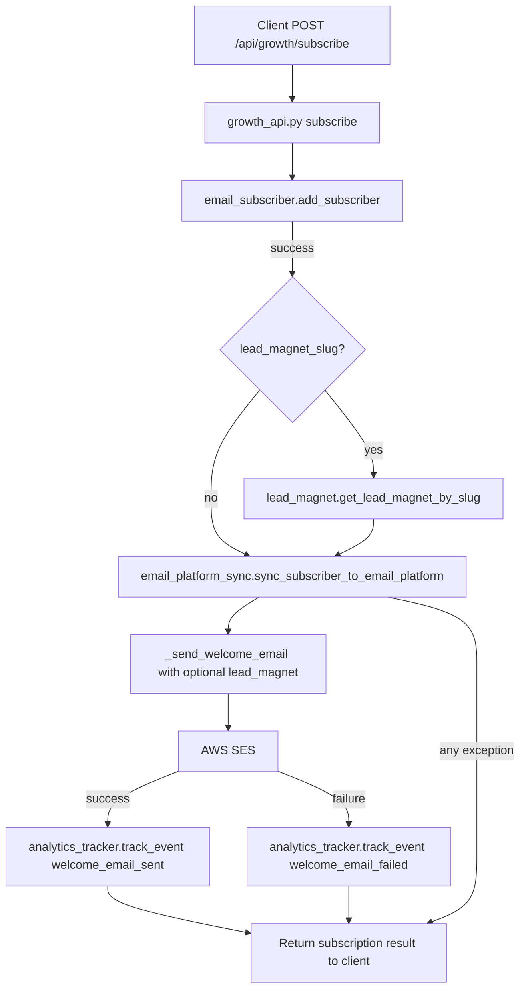
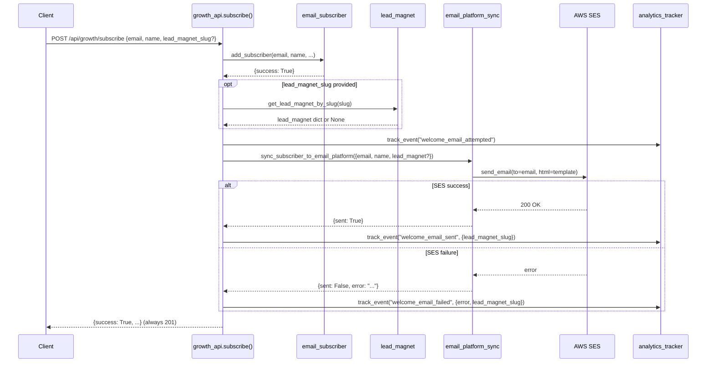

# Design Document: Welcome Email Integration

## Overview

This feature wires the existing `sync_subscriber_to_email_platform()` function into the `subscribe()` endpoint in `growth_api.py`, so that every new subscriber automatically receives a welcome email via AWS SES. The email sending is non-blocking — subscription always succeeds even if the email fails.

The enhancement also adds optional lead magnet support to the welcome email template. When a subscriber signs up with a `lead_magnet_slug`, the welcome email includes a direct download link for that lead magnet. Analytics events (`welcome_email_attempted` / `welcome_email_sent` / `welcome_email_failed`) are tracked for observability. No raw email addresses are stored in analytics event_data — only metadata like lead_magnet_slug and error messages.

This is an additive enhancement to the existing growth module. No new files, tables, or providers are introduced. Only four files are modified: `growth/growth_api.py`, `growth/email_platform_sync.py`, `growth/analytics_tracker.py`, and a new `docs/WELCOME_EMAIL_MODULE.md`.

## Architecture



## Sequence Diagram: Subscribe with Welcome Email



## Components and Interfaces

### Component 1: growth_api.py — subscribe() Enhancement

**Purpose**: Wire welcome email sending into the existing subscribe flow after successful subscription.

**Current Interface** (unchanged — no new endpoints):
```python
@growth_bp.route("/subscribe", methods=["POST"])
def subscribe():
    # Existing: add_subscriber, lead_magnet lookup
    # NEW: call sync_subscriber_to_email_platform after subscription
    # NEW: track welcome_email_sent / welcome_email_failed
```

**Responsibilities**:
- Call `sync_subscriber_to_email_platform()` after successful `add_subscriber()`
- Pass lead_magnet dict (if resolved) to the sync function
- Track analytics events for email success/failure
- Catch all exceptions from email sending — never let email failure break subscription
- Return subscription result to client regardless of email outcome

### Component 2: email_platform_sync.py — Lead Magnet Template Enhancement

**Purpose**: Enhance `_send_welcome_email()` to accept an optional `lead_magnet` dict and include a download link in the HTML template.

**Enhanced Interface**:
```python
def _send_welcome_email(email: str, name: str = None, lead_magnet: dict = None) -> dict:
    """Send welcome email via SES, optionally including lead magnet download link."""
    # Returns: {"sent": True/False, "provider": "ses", "error"?: "..."}

def sync_subscriber_to_email_platform(subscriber_data: dict) -> dict:
    """subscriber_data now accepts optional 'lead_magnet' key."""
    # subscriber_data = {"email": "...", "name": "...", "lead_magnet": {...} | None}
```

**Responsibilities**:
- Accept optional `lead_magnet` dict with keys: `title`, `slug`, `download_url`
- Render a download button/link in the HTML template when lead_magnet is present
- Keep existing template unchanged when no lead_magnet is provided
- Maintain backward compatibility — existing callers without lead_magnet still work

### Component 3: analytics_tracker.py — New Event Types

**Purpose**: Add `welcome_email_attempted`, `welcome_email_sent`, and `welcome_email_failed` to `ALLOWED_EVENT_TYPES`.

**Change**:
```python
ALLOWED_EVENT_TYPES = frozenset([
    # ... existing types ...
    "welcome_email_attempted",  # NEW — tracked before send attempt
    "welcome_email_sent",       # NEW — tracked after successful send
    "welcome_email_failed",     # NEW — tracked after failed send
])
```

**Responsibilities**:
- Allow tracking of welcome email lifecycle (attempted → sent/failed)
- No other changes to analytics_tracker logic

## Data Models

### subscriber_data (Enhanced)

```python
# Passed to sync_subscriber_to_email_platform()
subscriber_data = {
    "email": str,           # required — subscriber email
    "name": str | None,     # optional — subscriber name
    "lead_magnet": {        # optional — only if lead_magnet_slug was provided
        "id": str,
        "title": str,
        "slug": str,
        "download_url": str,
    } | None,
}
```

### Analytics Event Data

No raw email addresses are stored in analytics event_data. Raw email stays only in the subscriber system and SES send path.

```python
# welcome_email_attempted — tracked before calling sync_subscriber_to_email_platform()
event_data = {
    "lead_magnet_slug": str | None,  # included if lead magnet was attached
}

# welcome_email_sent — tracked after successful SES send
event_data = {
    "lead_magnet_slug": str | None,
}

# welcome_email_failed — tracked after SES send failure
event_data = {
    "error": str,                     # SES error message (no email address)
    "lead_magnet_slug": str | None,
}
```


## Key Functions with Formal Specifications

### Function 1: subscribe() — Enhanced (growth_api.py)

```python
def subscribe() -> tuple[Response, int]:
```

**Preconditions:**
- Request body contains valid JSON with `email` field (non-empty string)
- `add_subscriber()` is available and functional
- DynamoDB subscriber table is initialized

**Postconditions:**
- If `add_subscriber()` succeeds: returns 201 with `{success: True}`
- If `add_subscriber()` returns duplicate: returns 409
- If `add_subscriber()` fails: returns 400
- Welcome email sending NEVER affects the HTTP response status
- If email sending raises any exception, it is caught and logged — subscription result is returned unchanged
- Analytics event is tracked for email outcome (best-effort, failure is silent)

**Loop Invariants:** N/A

### Function 2: _send_welcome_email() — Enhanced (email_platform_sync.py)

```python
def _send_welcome_email(email: str, name: str = None, lead_magnet: dict = None) -> dict:
```

**Preconditions:**
- `email` is a non-empty string (valid email format assumed — SES validates)
- `name` is optional string or None
- `lead_magnet` is None or a dict with keys: `title`, `slug`, `download_url`
- SES client is available (`_get_ses()` returns valid client)
- `SES_SENDER` is a verified SES sender address

**Postconditions:**
- Returns `{"sent": True, "provider": "ses"}` on success
- Returns `{"sent": False, "provider": "ses", "error": str}` on failure
- When `lead_magnet` is provided and has `download_url`: HTML template includes download link section
- When `lead_magnet` is None: HTML template is identical to current behavior
- Function never raises — all exceptions are caught and returned as error dict

**Loop Invariants:** N/A

### Function 3: sync_subscriber_to_email_platform() — Enhanced (email_platform_sync.py)

```python
def sync_subscriber_to_email_platform(subscriber_data: dict) -> dict:
```

**Preconditions:**
- `subscriber_data` contains `email` key (non-empty string)
- `subscriber_data` may contain `name` (str or None) and `lead_magnet` (dict or None)

**Postconditions:**
- Passes `lead_magnet` from `subscriber_data` through to `_send_welcome_email()`
- Return value unchanged in structure from current implementation
- Backward compatible — callers without `lead_magnet` key still work

**Loop Invariants:** N/A

## Algorithmic Pseudocode

### Enhanced subscribe() Flow

```python
# growth_api.py subscribe() — enhanced section (after existing add_subscriber call)

def subscribe():
    # ... existing code: parse request, call add_subscriber() ...

    if result.get("success"):
        # Existing: resolve lead_magnet if slug provided
        lead_magnet = None
        lead_magnet_slug = data.get("lead_magnet_slug")
        if lead_magnet_slug:
            lm = get_lead_magnet_by_slug(lead_magnet_slug)
            if lm:
                lead_magnet = {
                    "id": lm["id"],
                    "title": lm["title"],
                    "slug": lm["slug"],
                    "download_url": lm["download_url"],
                }
                result["lead_magnet"] = lead_magnet
                # existing: track lead_magnet_clicked

        # NEW: Send welcome email (non-blocking, failure-safe)
        try:
            from growth.email_platform_sync import sync_subscriber_to_email_platform
            from growth.analytics_tracker import track_event

            # Track attempt before sending
            try:
                track_event(
                    event_type="welcome_email_attempted",
                    event_data={"lead_magnet_slug": lead_magnet_slug},
                )
            except Exception:
                pass

            email_result = sync_subscriber_to_email_platform({
                "email": email,
                "name": data.get("name"),
                "lead_magnet": lead_magnet,
            })

            # Track outcome via analytics (no raw email in event_data)
            try:
                if email_result.get("sent"):
                    track_event(
                        event_type="welcome_email_sent",
                        event_data={"lead_magnet_slug": lead_magnet_slug},
                    )
                else:
                    track_event(
                        event_type="welcome_email_failed",
                        event_data={
                            "error": email_result.get("error", "unknown"),
                            "lead_magnet_slug": lead_magnet_slug,
                        },
                    )
            except Exception:
                pass
        except Exception as exc:
            logger.warning("Welcome email failed for subscriber: %s", exc)

        return jsonify(result), 201
```

### Enhanced _send_welcome_email() Template Logic

```python
def _send_welcome_email(email: str, name: str = None, lead_magnet: dict = None) -> dict:
    display_name = name or "there"

    # Build lead magnet section (empty string if no lead_magnet)
    lead_magnet_html = ""
    lead_magnet_text = ""
    if lead_magnet and lead_magnet.get("download_url"):
        lm_title = lead_magnet.get("title", "Your Free Resource")
        lm_url = lead_magnet["download_url"]
        lead_magnet_html = f"""
            <div style="background:rgba(0,212,255,0.08);border:1px solid rgba(0,212,255,0.2);border-radius:12px;padding:20px;margin:20px 0;">
                <p style="color:#00d4ff;font-weight:600;margin:0 0 8px;">🎁 {lm_title}</p>
                <a href="{lm_url}" style="display:inline-block;padding:10px 24px;background:#7b2cbf;color:#fff;text-decoration:none;border-radius:8px;font-weight:600;">Download Now</a>
            </div>
        """
        lead_magnet_text = f"\n\nYour free resource: {lm_title}\nDownload: {lm_url}"

    # Insert lead_magnet_html into existing template (after the bullet list)
    # Insert lead_magnet_text into existing text body
    # ... rest of existing SES send logic unchanged ...
```

### Enhanced sync_subscriber_to_email_platform()

```python
def sync_subscriber_to_email_platform(subscriber_data: dict) -> dict:
    email = subscriber_data.get("email")
    name = subscriber_data.get("name")
    lead_magnet = subscriber_data.get("lead_magnet")  # NEW: extract lead_magnet

    if PLATFORM == "ses":
        return _send_welcome_email(email, name, lead_magnet)  # NEW: pass lead_magnet

    # ... rest unchanged ...
```

## Example Usage

```python
# Example 1: Subscribe without lead magnet
import requests
resp = requests.post("https://ai1stseo.com/api/growth/subscribe", json={
    "email": "user@example.com",
    "name": "Alice",
    "source": "homepage",
})
# Result: 201, welcome email sent, analytics tracked

# Example 2: Subscribe with lead magnet
resp = requests.post("https://ai1stseo.com/api/growth/subscribe", json={
    "email": "user@example.com",
    "name": "Bob",
    "source": "landing_page",
    "lead_magnet_slug": "seo-starter-checklist",
})
# Result: 201, welcome email includes download link, analytics tracked

# Example 3: SES failure — subscription still succeeds
# If SES is down or email is unverified:
# Result: 201, subscription saved, welcome_email_failed event tracked
```

## Correctness Properties

*A property is a characteristic or behavior that should hold true across all valid executions of a system — essentially, a formal statement about what the system should do. Properties serve as the bridge between human-readable specifications and machine-verifiable correctness guarantees.*

### Property 1: Subscription always returns 201 regardless of email/analytics outcome

*For any* successful `add_subscriber()` result, and *for any* outcome of `sync_subscriber_to_email_platform()` (success, failure, or exception) and *for any* outcome of `track_event()` (success or exception), the `subscribe()` endpoint SHALL return HTTP status 201 with `{"success": true}`.

**Validates: Requirements 2.1, 2.2, 2.3, 7.2, 7.3**

### Property 2: Sync only called on successful add_subscriber

*For any* subscriber input, `sync_subscriber_to_email_platform()` is called if and only if `add_subscriber()` returns a successful result. For any non-successful result (duplicate or failure), `sync_subscriber_to_email_platform()` is never called.

**Validates: Requirements 1.1, 1.2, 1.3**

### Property 3: Lead magnet download URL appears in email when provided

*For any* lead magnet dict containing a non-empty `download_url` and `title`, when passed to `_send_welcome_email()`, the resulting HTML body SHALL contain the `download_url` and the resulting plain text body SHALL contain the `download_url`.

**Validates: Requirements 3.1, 3.2, 3.3**

### Property 4: Backward compatibility — no lead_magnet produces identical output

*For any* valid email string and optional name string, calling `_send_welcome_email(email, name)` without the `lead_magnet` parameter SHALL produce output identical to calling `_send_welcome_email(email, name, None)`. Calling `sync_subscriber_to_email_platform()` with a `subscriber_data` dict that does not contain a `lead_magnet` key SHALL not raise an error.

**Validates: Requirements 3.4, 6.1, 6.2, 6.3**

### Property 5: Analytics events never contain raw email addresses

*For any* subscriber email address, the `event_data` dict passed to `track_event()` for `welcome_email_attempted`, `welcome_email_sent`, and `welcome_email_failed` events SHALL not contain the subscriber email address as a key or value.

**Validates: Requirements 5.1, 5.2**

### Property 6: Analytics lifecycle — attempted event precedes outcome event

*For any* successful subscription where email sending is attempted, a `welcome_email_attempted` event is tracked before calling `sync_subscriber_to_email_platform()`. After the sync call, exactly one of `welcome_email_sent` (when `sent` is true) or `welcome_email_failed` (when `sent` is false) is tracked.

**Validates: Requirements 4.1, 4.2, 4.3**

### Property 7: Analytics failure does not prevent email sending

*For any* exception raised by `track_event()` when tracking the `welcome_email_attempted` event, the `subscribe()` endpoint SHALL still proceed to call `sync_subscriber_to_email_platform()`.

**Validates: Requirements 7.1**

## Error Handling

### Scenario 1: SES Send Failure

**Condition**: AWS SES rejects the email (invalid address, sending quota, sandbox mode)
**Response**: `_send_welcome_email()` catches the exception, returns `{"sent": False, "error": "..."}`
**Recovery**: `subscribe()` logs warning, tracks `welcome_email_failed` event, returns 201 to client

### Scenario 2: SES Client Initialization Failure

**Condition**: `_get_ses()` fails (missing AWS credentials, network issue)
**Response**: Exception caught in `_send_welcome_email()`, returns error dict
**Recovery**: Same as Scenario 1 — subscription succeeds, failure tracked

### Scenario 3: Analytics Tracking Failure

**Condition**: DynamoDB analytics table unavailable when tracking email outcome
**Response**: Exception caught in outer try/except in `subscribe()`, logged as warning
**Recovery**: Subscription still returns 201 — analytics is best-effort

### Scenario 4: Invalid Lead Magnet Slug

**Condition**: `lead_magnet_slug` provided but `get_lead_magnet_by_slug()` returns None
**Response**: `lead_magnet` stays None, welcome email sent without download link
**Recovery**: Normal flow — email sent with standard template

## Testing Strategy

### Unit Testing Approach

- Mock `_get_ses()` to test `_send_welcome_email()` with and without lead_magnet
- Mock `sync_subscriber_to_email_platform()` in subscribe() tests to verify it's called with correct args
- Test that subscribe() returns 201 even when sync raises an exception
- Test HTML template contains download link when lead_magnet is provided
- Test HTML template is unchanged when lead_magnet is None

### Property-Based Testing Approach

**Property Test Library**: hypothesis (Python)

- For any valid email and optional name/lead_magnet, `_send_welcome_email()` never raises
- For any subscriber_data dict with email key, `sync_subscriber_to_email_platform()` returns a dict with `sent` key
- For any combination of SES success/failure, subscribe() always returns a valid HTTP response

### Integration Testing Approach

- End-to-end test: POST /api/growth/subscribe → verify welcome email sent via SES mock
- Verify analytics events are created in DynamoDB for both success and failure cases
- Test with real lead_magnet_slug to verify download link appears in email

## Security Considerations

- Email addresses are passed to SES as-is — SES handles validation and bounce management
- Lead magnet download URLs are from the static registry (not user-supplied) — no injection risk
- No PII is stored in analytics events — raw email stays only in the subscriber system and SES send path, never in analytics event_data
- SES sender address is configured via environment variable, not hardcoded in templates

## Dependencies

- **AWS SES** — existing dependency, no changes
- **AWS DynamoDB** — existing dependency for analytics, no new tables
- **boto3** — existing dependency
- **growth/email_subscriber.py** — existing, no changes
- **growth/lead_magnet.py** — existing, no changes
- **growth/analytics_tracker.py** — additive change only (new event types)

## Risks and Mitigations

| Risk | Impact | Mitigation |
|------|--------|------------|
| SES sending quota exceeded | Welcome emails silently fail | Track `welcome_email_failed` events, monitor via analytics summary |
| SES sandbox mode (unverified recipients) | Emails only sent to verified addresses | Document SES production access requirement |
| Slow SES API response | Subscribe endpoint latency increases | Email sending is synchronous but failure-safe; future: move to async/queue |
| Lead magnet download_url changes | Stale links in sent emails | URLs come from static registry — update registry to update links |

## Files Modified

| File | Change Type | Description |
|------|-------------|-------------|
| `growth/growth_api.py` | Modified | Add `sync_subscriber_to_email_platform()` call + analytics tracking in `subscribe()` |
| `growth/email_platform_sync.py` | Modified | Add `lead_magnet` param to `_send_welcome_email()` and `sync_subscriber_to_email_platform()`, enhance HTML template |
| `growth/analytics_tracker.py` | Modified | Add `welcome_email_attempted`, `welcome_email_sent`, and `welcome_email_failed` to `ALLOWED_EVENT_TYPES` |
| `docs/WELCOME_EMAIL_MODULE.md` | Created | Module documentation |
