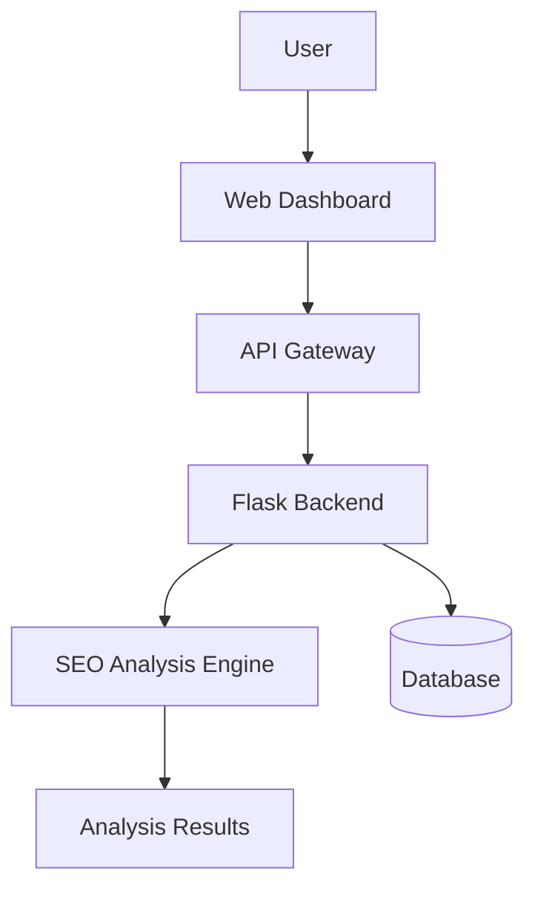
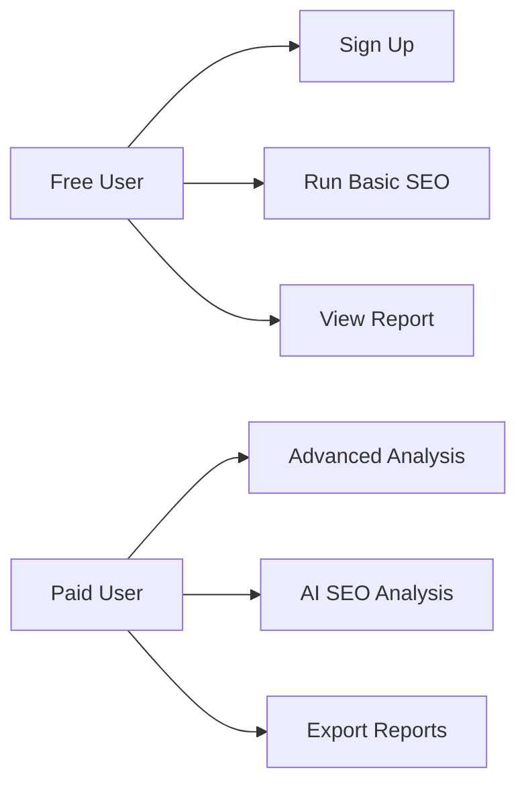
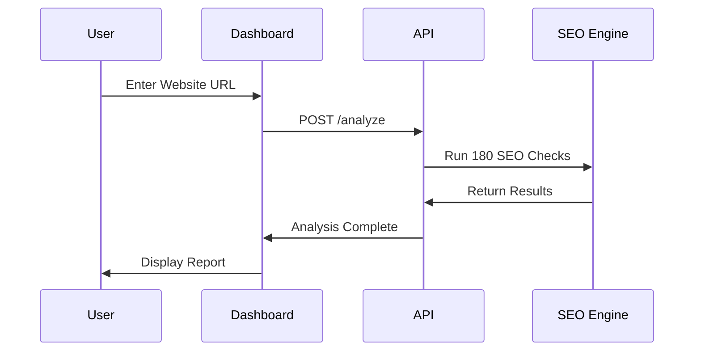
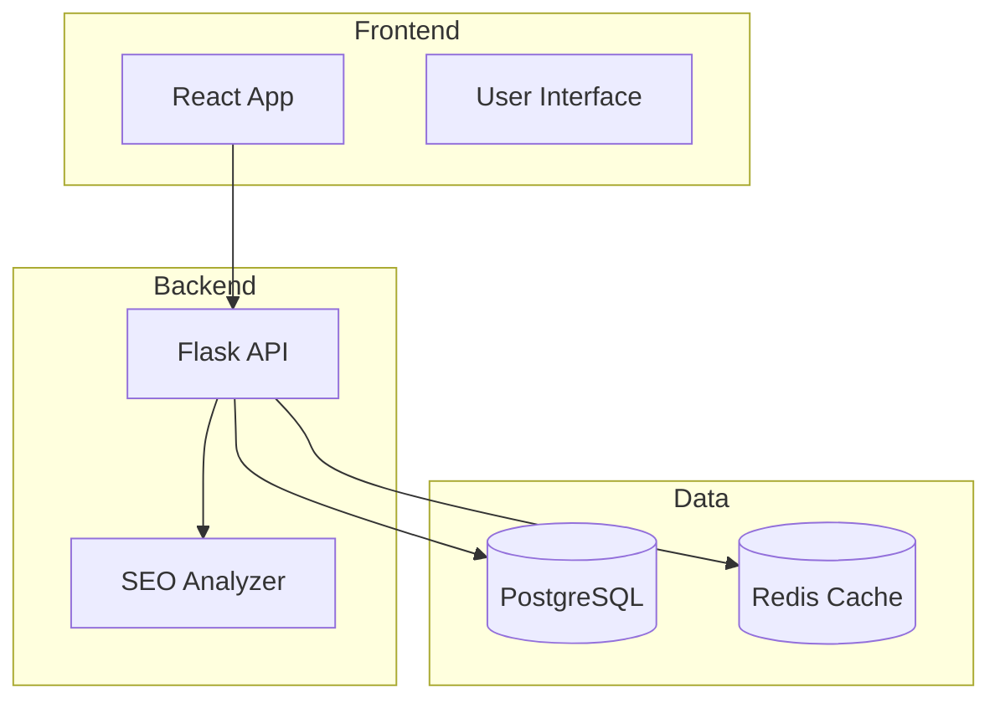
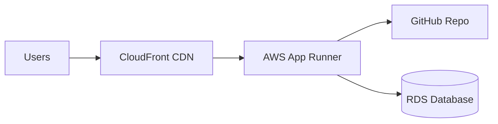
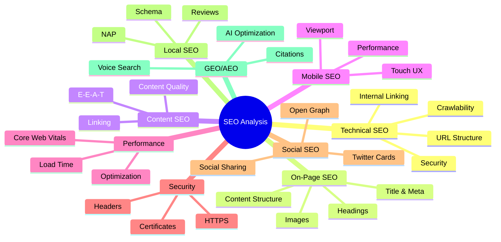

# AI1stSEO Platform - UML System Design

## Overview
Interactive Mermaid diagrams showing the AI1stSEO platform architecture.

---

## System Architecture

## Use Case Diagram

## Data Flow

## Component Architecture

## Deployment Architecture

## SEO Analysis Categories

