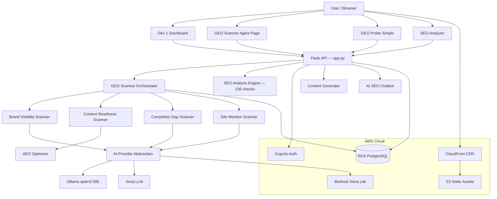
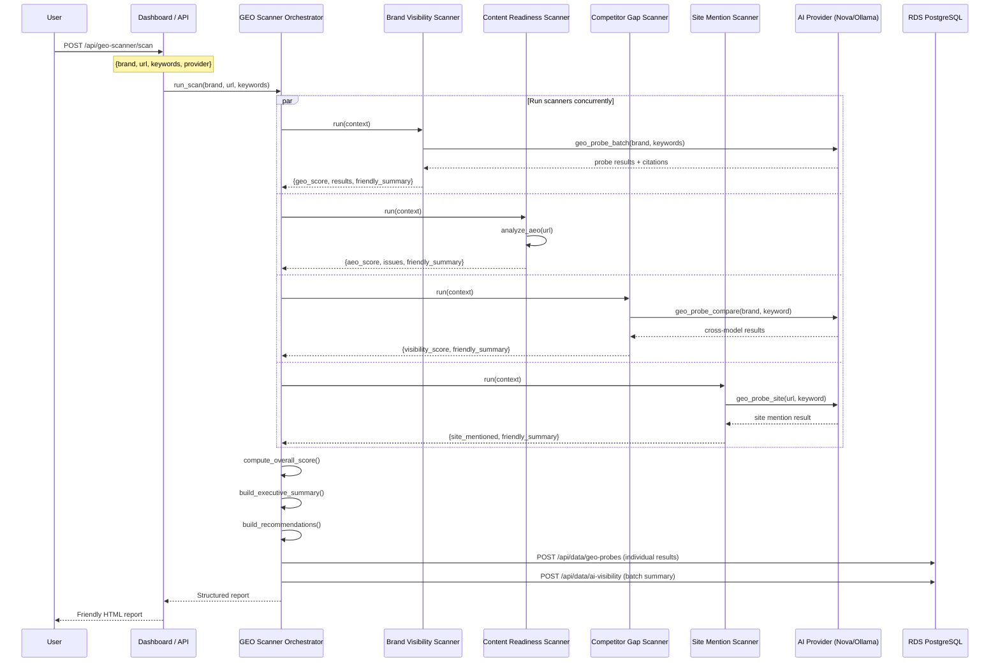
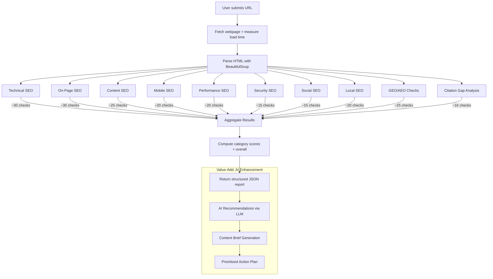
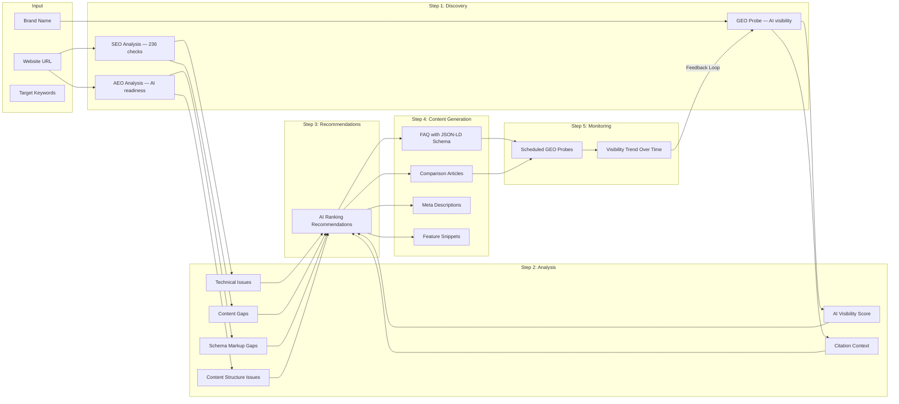
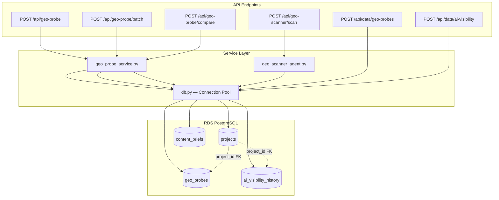
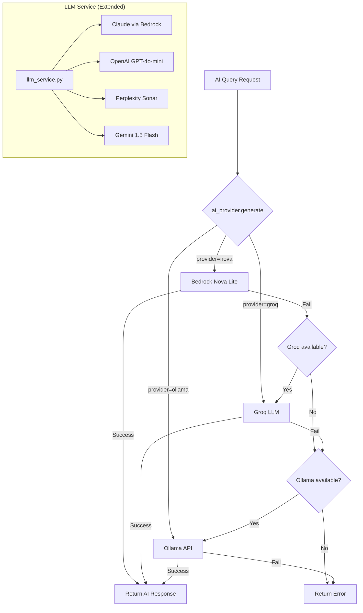
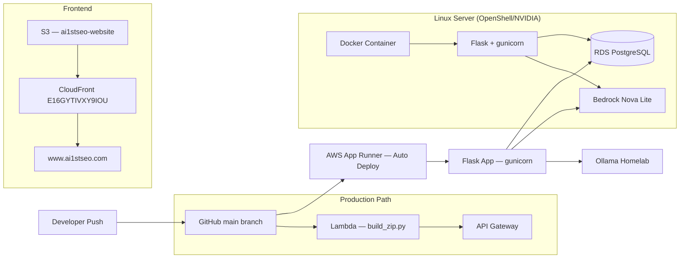
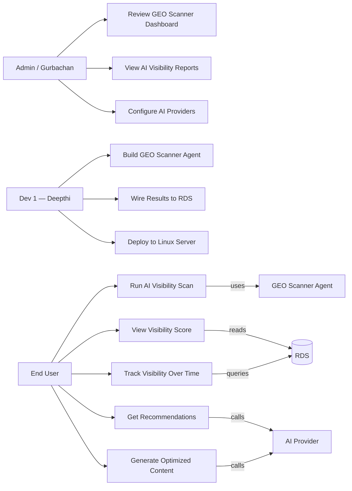

# AI1stSEO Platform - UML System Design

## Overview
Interactive Mermaid diagrams showing the AI1stSEO platform architecture, GEO Scanner Agent workflows, SEO analysis pipelines, and content optimization processes.

> **Last Updated:** March 26, 2026 — Phase 1 (Dev 1 AI/ML)

---

## 1. System Architecture (Full Stack)

```mermaid
flowchart TD
    User[User / Browser] --> Dashboard[Dev 1 Dashboard]
    User --> GeoScanner[GEO Scanner Agent Page]
    User --> GeoTest[GEO Probe Simple]
    User --> Analyzer[SEO Analyzer]

    Dashboard --> API[Flask API — app.py]
    GeoScanner --> API
    GeoTest --> API
    Analyzer --> API

    API --> Orchestrator[GEO Scanner Orchestrator]
    API --> SEOEngine[SEO Analysis Engine — 236 checks]
    API --> Auth[Cognito Auth]
    API --> ContentGen[Content Generator]
    API --> Chatbot[AI SEO Chatbot]

    Orchestrator --> BVScanner[Brand Visibility Scanner]
    Orchestrator --> CRScanner[Content Readiness Scanner]
    Orchestrator --> CGScanner[Competitor Gap Scanner]
    Orchestrator --> SMScanner[Site Mention Scanner]

    BVScanner --> AIProvider[AI Provider Abstraction]
    CGScanner --> AIProvider
    SMScanner --> AIProvider

    AIProvider --> Nova[Bedrock Nova Lite]
    AIProvider --> Ollama[Ollama qwen3:30b]
    AIProvider --> Groq[Groq LLM]

    CRScanner --> AEO[AEO Optimizer]

    API --> RDS[(RDS PostgreSQL)]
    Orchestrator --> RDS

    subgraph AWS Cloud
        Nova
        RDS
        Auth
        CF[CloudFront CDN]
        S3[S3 Static Assets]
    end

    CF --> S3
    User --> CF
```

---

## 2. GEO Scanner Agent — Orchestrator Flow

```mermaid
sequenceDiagram
    participant U as User
    participant D as Dashboard / API
    participant O as GEO Scanner Orchestrator
    participant BV as Brand Visibility Scanner
    participant CR as Content Readiness Scanner
    participant CG as Competitor Gap Scanner
    participant SM as Site Mention Scanner
    participant AI as AI Provider (Nova/Ollama)
    participant DB as RDS PostgreSQL

    U->>D: POST /api/geo-scanner/scan
    Note over D: {brand, url, keywords, provider}
    D->>O: run_scan(brand, url, keywords)

    par Run scanners concurrently
        O->>BV: run(context)
        BV->>AI: geo_probe_batch(brand, keywords)
        AI-->>BV: probe results + citations
        BV-->>O: {geo_score, results, friendly_summary}
    and
        O->>CR: run(context)
        CR->>CR: analyze_aeo(url)
        CR-->>O: {aeo_score, issues, friendly_summary}
    and
        O->>CG: run(context)
        CG->>AI: geo_probe_compare(brand, keyword)
        AI-->>CG: cross-model results
        CG-->>O: {visibility_score, friendly_summary}
    and
        O->>SM: run(context)
        SM->>AI: geo_probe_site(url, keyword)
        AI-->>SM: site mention result
        SM-->>O: {site_mentioned, friendly_summary}
    end

    O->>O: compute_overall_score()
    O->>O: build_executive_summary()
    O->>O: build_recommendations()

    O->>DB: POST /api/data/geo-probes (individual results)
    O->>DB: POST /api/data/ai-visibility (batch summary)

    O-->>D: Structured report
    D-->>U: Friendly HTML report
```

---

## 3. SEO Analysis Workflow (236 Checks)

```mermaid
flowchart TD
    Start[User submits URL] --> Fetch[Fetch webpage + measure load time]
    Fetch --> Parse[Parse HTML with BeautifulSoup]

    Parse --> C1[Technical SEO]
    Parse --> C2[On-Page SEO]
    Parse --> C3[Content SEO]
    Parse --> C4[Mobile SEO]
    Parse --> C5[Performance SEO]
    Parse --> C6[Security SEO]
    Parse --> C7[Social SEO]
    Parse --> C8[Local SEO]
    Parse --> C9[GEO/AEO Checks]
    Parse --> C10[Citation Gap Analysis]

    C1 --> |~30 checks| Agg[Aggregate Results]
    C2 --> |~30 checks| Agg
    C3 --> |~25 checks| Agg
    C4 --> |~20 checks| Agg
    C5 --> |~20 checks| Agg
    C6 --> |~15 checks| Agg
    C7 --> |~15 checks| Agg
    C8 --> |~20 checks| Agg
    C9 --> |~25 checks| Agg
    C10 --> |~16 checks| Agg

    Agg --> Score[Compute category scores + overall]
    Score --> Report[Return structured JSON report]

    subgraph "Value-Add: AI Enhancement"
        Report --> AIRec[AI Recommendations via LLM]
        AIRec --> ContentBrief[Content Brief Generation]
        ContentBrief --> ActionPlan[Prioritized Action Plan]
    end
```

---

## 4. Content Analysis & Optimization Pipeline

```mermaid
flowchart LR
    subgraph Input
        URL[Website URL]
        Brand[Brand Name]
        KW[Target Keywords]
    end

    subgraph "Step 1: Discovery"
        URL --> SEOScan[SEO Analysis — 236 checks]
        URL --> AEOScan[AEO Analysis — AI readiness]
        Brand --> GEOProbe[GEO Probe — AI visibility]
    end

    subgraph "Step 2: Analysis"
        SEOScan --> TechIssues[Technical Issues]
        SEOScan --> ContentGaps[Content Gaps]
        AEOScan --> SchemaGaps[Schema Markup Gaps]
        AEOScan --> StructureIssues[Content Structure Issues]
        GEOProbe --> VisibilityScore[AI Visibility Score]
        GEOProbe --> CitationContext[Citation Context]
    end

    subgraph "Step 3: Recommendations"
        TechIssues --> Recs[AI Ranking Recommendations]
        ContentGaps --> Recs
        SchemaGaps --> Recs
        StructureIssues --> Recs
        VisibilityScore --> Recs
        CitationContext --> Recs
    end

    subgraph "Step 4: Content Generation"
        Recs --> FAQ[FAQ with JSON-LD Schema]
        Recs --> Compare[Comparison Articles]
        Recs --> Meta[Meta Descriptions]
        Recs --> Snippets[Feature Snippets]
    end

    subgraph "Step 5: Monitoring"
        FAQ --> Monitor[Scheduled GEO Probes]
        Compare --> Monitor
        Monitor --> Trend[Visibility Trend Over Time]
        Trend --> |Feedback Loop| GEOProbe
    end
```

---

## 5. Data Flow — RDS Persistence

```mermaid
flowchart TD
    subgraph "API Endpoints"
        EP1[POST /api/geo-probe]
        EP2[POST /api/geo-probe/batch]
        EP3[POST /api/geo-probe/compare]
        EP4[POST /api/geo-scanner/scan]
        EP5[POST /api/data/geo-probes]
        EP6[POST /api/data/ai-visibility]
    end

    subgraph "Service Layer"
        GS[geo_probe_service.py]
        GA[geo_scanner_agent.py]
        DB[db.py — Connection Pool]
    end

    subgraph "RDS PostgreSQL"
        T1[(geo_probes)]
        T2[(ai_visibility_history)]
        T3[(projects)]
        T4[(content_briefs)]
    end

    EP1 --> GS --> DB
    EP2 --> GS --> DB
    EP3 --> GS --> DB
    EP4 --> GA --> DB
    EP5 --> DB
    EP6 --> DB

    DB --> T1
    DB --> T2
    DB --> T3
    DB --> T4

    T3 -.->|project_id FK| T1
    T3 -.->|project_id FK| T2
```

---

## 6. AI Provider Routing & Fallback Chain

```mermaid
flowchart TD
    Request[AI Query Request] --> Router{ai_provider.generate}

    Router -->|provider=nova| Nova[Bedrock Nova Lite]
    Router -->|provider=ollama| Ollama[Ollama API]
    Router -->|provider=groq| Groq[Groq LLM]

    Nova -->|Success| Response[Return AI Response]
    Nova -->|Fail| FallbackGroq{Groq available?}
    FallbackGroq -->|Yes| Groq
    FallbackGroq -->|No| FallbackOllama{Ollama available?}
    Groq -->|Success| Response
    Groq -->|Fail| FallbackOllama
    FallbackOllama -->|Yes| Ollama
    FallbackOllama -->|No| Error[Return Error]
    Ollama -->|Success| Response
    Ollama -->|Fail| Error

    subgraph "LLM Service (Extended)"
        LLM[llm_service.py]
        LLM --> Claude[Claude via Bedrock]
        LLM --> OpenAI[OpenAI GPT-4o-mini]
        LLM --> Perplexity[Perplexity Sonar]
        LLM --> Gemini[Gemini 1.5 Flash]
    end
```

---

## 7. Deployment Architecture

```mermaid
flowchart LR
    Dev[Developer Push] --> GitHub[GitHub main branch]
    GitHub --> AppRunner[AWS App Runner — Auto Deploy]
    AppRunner --> Flask[Flask App — gunicorn]

    Flask --> RDS[(RDS PostgreSQL)]
    Flask --> Bedrock[Bedrock Nova Lite]
    Flask --> Ollama[Ollama Homelab]

    subgraph "Production Path"
        GitHub --> Lambda[Lambda — build_zip.py]
        Lambda --> APIGW[API Gateway]
    end

    subgraph "Frontend"
        S3[S3 — ai1stseo-website] --> CF[CloudFront E16GYTIVXY9IOU]
        CF --> WWW[www.ai1stseo.com]
    end

    subgraph "Linux Server (OpenShell/NVIDIA)"
        Docker[Docker Container]
        Docker --> FlaskLinux[Flask + gunicorn]
        FlaskLinux --> RDS
        FlaskLinux --> Bedrock
    end
```

---

## 8. Use Case Diagram — Phase 1

```mermaid
flowchart LR
    Admin[Admin / Gurbachan] --> ReviewDashboard[Review GEO Scanner Dashboard]
    Admin --> ViewReports[View AI Visibility Reports]
    Admin --> ConfigProviders[Configure AI Providers]

    Dev1[Dev 1 — Deepthi] --> BuildScanner[Build GEO Scanner Agent]
    Dev1 --> WireRDS[Wire Results to RDS]
    Dev1 --> DeployLinux[Deploy to Linux Server]

    EndUser[End User] --> RunScan[Run AI Visibility Scan]
    EndUser --> ViewScore[View Visibility Score]
    EndUser --> GetRecs[Get Recommendations]
    EndUser --> TrackTrend[Track Visibility Over Time]
    EndUser --> GenContent[Generate Optimized Content]

    RunScan --> |uses| GEOAgent[GEO Scanner Agent]
    ViewScore --> |reads| RDS[(RDS)]
    GetRecs --> |calls| AIProvider[AI Provider]
    TrackTrend --> |queries| RDS
    GenContent --> |calls| AIProvider
```
