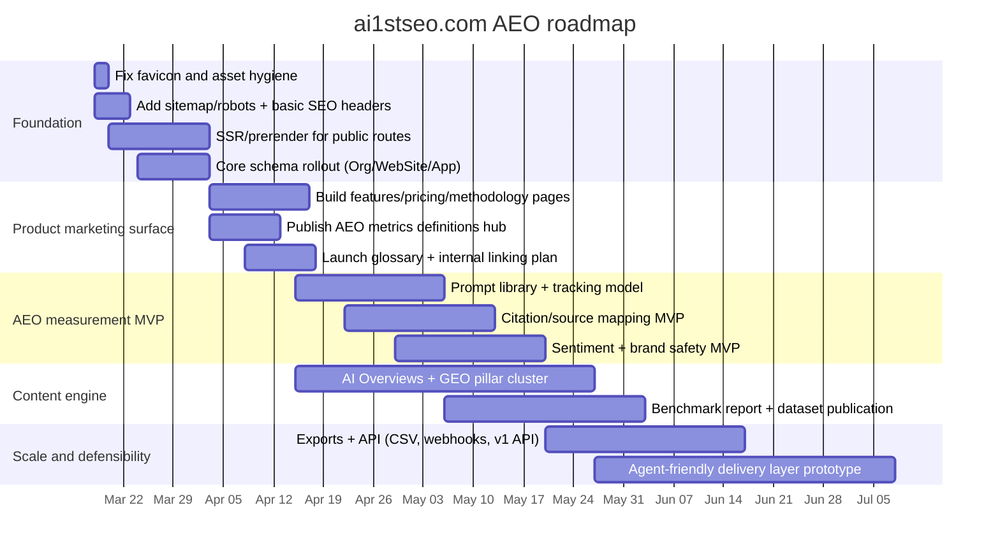

# AI1stSEO and AEO Market Research Report

## Executive summary

ai1stseo.com currently presents as an extremely young, lightweight single-page web presence with limited publicly discoverable site architecture (effectively one indexed landing page) and several “early-stage” technical polish gaps (notably a missing favicon returning 404, plus SPA-style delivery that typically increases crawl/render risk if not paired with SSR/prerender and strong metadata discipline). citeturn7view0turn16search6turn15search0

From publicly visible signals, the site positions itself as an “AI-First SEO platform” (“AISEO Master”) oriented around improving citations/visibility in LLM answer systems (e.g., ChatGPT, Perplexity, Claude, Gemini). citeturn7view0turn16search3 However, the current public footprint does not yet demonstrate the depth of product evidence, trust signals, or content corpus that leading AEO/GEO (Answer/Generative Engine Optimization) competitors use to win evaluation cycles: prompt-level tracking, citation/source mapping, sentiment analysis, exports/APIs, enterprise security, and credible proof (case studies, benchmarks, methodology, and independent comparisons). citeturn26view2turn27search0turn25search0turn32search0turn35search1turn35search10turn36view1

Across the market, “AEO metrics” have converged around three measurement families:

1) **Prompt-level visibility + competitive share** (how often you show up, and where, for specific conversational prompts), citeturn25search7turn26view2turn35search3  
2) **Citation/source influence mapping** (what domains/URLs/models cite or “use” your sources), citeturn25search0turn26view2turn37search7  
3) **Brand interpretation quality** (sentiment, contradictions, safety, freshness, and entity accuracy). citeturn25search0turn29view3turn38news47  

The key strategic implication: for “agent-first” discoverability, being indexed is table stakes; **being structured, extractable, and trustworthy** is what turns pages into citations. Scrunch summarizes this as making meaning explicit (clear headings, pricing/specs/FAQs/tables), ensuring crawlability, and publishing citable evidence. citeturn26view2 AEOImpact’s scoring logic similarly emphasizes schema/Q&A coverage, intro clarity, semantic coherence, and recrawl timing. citeturn29view3turn29view2

## Methodology and assumptions

The analysis uses only publicly available evidence gathered via web search and third-party web scan artifacts. First-party analytics (Google Search Console, server logs, CRM attribution, paid SEO tools logged-in exports) were not available, so traffic, backlinks, and rankings cannot be asserted with high confidence; where relevant, this report explicitly flags those gaps and provides best-effort directional inference.

Key assumptions:

- **Competitor set (top 6)**: selected to represent (a) AEO-first platforms, (b) SEO suites adding AI visibility capabilities, and (c) agency-led “OmniSEO/LLM marketing” offerings. The selected top 6 are: **Scrunch**, **Peec AI**, **Semrush**, **Ahrefs**, **Conductor**, and **WebFX/SEO.com**. citeturn26view2turn27search0turn25search0turn27search1turn34view0turn35search1turn35search10turn36view1  
- “AEO” here is used broadly to include optimization for **Google AI Overviews/AI Mode** and third-party LLM answer engines; measurement approaches differ by vendor and platform. citeturn26view2turn25search1turn32search0turn35search1turn29view3  
- Any mention of trends (including AI Overviews prevalence and brand sentiment differences) is sourced and treated as *industry-reported*, not universal ground truth. citeturn35search5turn38news47  

## ai1stseo.com audit

### Crawl and inventory snapshot

Publicly, ai1stseo.com appears to resolve primarily to a single landing page (“AISEO Master - AI-First SEO Platform”). citeturn7view0turn15search0 A urlscan capture indicates the site is served as a minimal HTML shell (347 bytes) that loads a JavaScript bundle and renders client-side. citeturn7view0

**Practical consequence (inference):** SPA delivery raises the probability of incomplete indexing for deeper routes unless the site uses SSR/prerendering, route-level metadata, and crawlable internal linking. This risk is well-known for JS-heavy apps in SEO contexts, even though modern Google can render JavaScript in many cases. citeturn7view0turn14search2

### Observed site assets and HTTP behavior

The following artifacts were directly observable from the urlscan result:

| Item | Observed URL path | Status | Notes |
|---|---:|---:|---|
| Primary HTML document | `/` | 200 | HTML payload ~347 B; title “AISEO Master - AI-First SEO Platform”. citeturn7view0 |
| Main JS bundle | `/assets/index-IokfcOpI.js` | 200 | File size reported ~415 KB; transfer ~122 KB (compressed). citeturn7view0 |
| Favicon | `/favicon.ico` | 404 | Missing favicon triggered console error in scan. citeturn7view0 |
| Hosting / infra signals | — | — | Response headers indicate Amazon S3 + CloudFront; TLS issued by Amazon. citeturn7view0turn16search6 |
| Client framework hint | — | — | `__reactRouterVersion` appears as a global variable. citeturn7view0 |

**Technical SEO implication:** the root page’s “no outgoing links” observation in the scan suggests either (a) navigation is rendered post-load in JS, (b) the site is a very minimal single-screen landing page, or (c) links are not standard `<a href>` elements. Any of these can reduce crawl discovery and link equity flow. citeturn7view0turn16search2

### Public positioning and content types

Search snippets for the homepage indicate positioning around optimizing for citations across multiple AI assistants and supporting a login/dashboard flow. citeturn16search3turn15search0

At minimum, the public content type appears to be:

- **Marketing landing page** (product positioning, CTA). citeturn15search0turn16search3  
- **Authentication / dashboard experience** implied by “Login” and “View Dashboard” wording in snippets. citeturn15search0turn16search3  

No public evidence was found (in this crawl scope) of an indexed blog, documentation center, pricing page, case studies, integration pages, API docs, or a security/compliance page—assets that are common for AEO competitors and materially affect both trust and citation potential. citeturn15search0turn26view2turn27search1turn35search1turn35search10turn36view1

### Metadata and schema

A direct HTML/source audit (meta tags, canonical, Open Graph, JSON-LD schema) could not be completed because the page content was not retrievable as a fully parsed document in this session. The urlscan evidence suggests an extremely small HTML shell, which often implies limited server-rendered metadata unless additional tooling (SSR/prerender, dynamic head management) is in place. citeturn7view0turn14search2

**Best-effort recommendation (based on competitor and industry practices):** implement server-rendered or prerendered metadata, and add schema types aligned to the product and content strategy (Organization, WebSite, SoftwareApplication, FAQPage, Article). Competitors explicitly emphasize structured data and machine readability as a core lever for AI visibility. citeturn26view2turn29view3turn36view3

### Indexability, mobile, and performance

- **Indexability:** Robots.txt and sitemap.xml were not discoverable within the available tool constraints, so index directives cannot be confirmed. The site is at least discoverable via a public snippet result, implying some level of indexation for the homepage. citeturn15search0turn7view0  
- **Mobile:** No direct Mobile-Friendly Test output was available, and Google’s legacy Mobile-Friendly Test tooling has been retired per Google. citeturn19search3  
- **Performance:** No Lighthouse/PageSpeed report for ai1stseo.com was retrievable here. The best available proxy is the observed payload pattern: very small HTML + a mid-sized JS bundle (~415 KB). citeturn7view0  

### Backlink profile and keyword rankings

No authoritative backlink index export or rankings report (Ahrefs Site Explorer / Semrush Domain Overview / Similarweb) was accessible for ai1stseo.com in this session. Therefore, this report **does not claim**:

- total referring domains / backlinks,  
- estimated organic traffic,  
- current keyword rankings, or  
- AI Overviews citation counts for the domain.

**Directional inference only:** The domain appears newly created around late January 2026 and is hosted on new AWS infrastructure with minimal page footprint, which is consistent with an early-stage site that likely has limited backlinks and minimal ranking coverage. citeturn16search6turn7view0

### Current site architecture visualization

```mermaid
flowchart TD
  A[ai1stseo.com /] --> B[Client-side JS app]
  B --> C[Implied: Login]
  B --> D[Implied: Dashboard]
  A --> E[/assets/index-*.js]
  A --> F[/favicon.ico (404)]
```

image_group{"layout":"carousel","aspect_ratio":"16:9","query":["ai1stseo.com AISEO Master AI-first SEO platform screenshot","Scrunch AI search visibility platform screenshot","Peec AI search analytics dashboard screenshot","Semrush AI Visibility Toolkit screenshot"],"num_per_query":1}

## Competitive landscape

### Selected top competitors

The table below summarizes the top 6 competitors selected for this analysis.

| Competitor | Segment | AEO/AIO focus | Pricing signal | API / integrations | Notable differentiators |
|---|---|---|---|---|---|
| **entity["company","Scrunch","ai search visibility platform"]** | AEO-first tooling | Prompt analytics, citations, AI bot observability | Core plan $250/mo; Enterprise custom. citeturn27search0turn27search2 | Enterprise includes Data API + SOC 2 / RBAC / SSO claims. citeturn26view2turn27search0 | “AXP” creates an AI-optimized parallel site for agents; also “AI traffic” feed. citeturn26view2 |
| **entity["company","Peec AI","ai search analytics tool"]** | AEO-first analytics | Visibility / position / sentiment + sources | Tiered by prompts; Enterprise includes API + SSO. citeturn27search1turn25search1 | Looker Studio connector + API (Enterprise). citeturn25search0turn27search1turn25search1 | Distinguishes brand mentions vs source “used” vs “cited”; prompt workflows. citeturn25search0turn25search1 |
| **entity["company","Semrush","seo software company"]** | SEO suite + AI toolkit | AI Visibility Toolkit tracks AI mentions, prompts, AI site audit checks | SEO Toolkit: $139.95/$249.95/$499.95 (Pro/Guru/Business). citeturn34view0 AI Visibility Toolkit: $99/mo add-on. citeturn32search0 | Semrush API offered; Business tier includes API access. citeturn30search7turn34view0 | Integrates AI visibility with classic SEO reports (Domain Overview, Organic Rankings, SERP features). citeturn37search0turn37search7 |
| **entity["company","Ahrefs","seo software company"]** | SEO suite + AI visibility add-on | Brand Radar + AI Visibility index across AI Overviews/AI Mode + assistants | Brand Radar costs $199/mo per index, $699 for all indexes; custom prompt packages. citeturn35search1turn35search3 | API & integrations available on higher plans; pricing page references direct API access + MCP server. citeturn31search0turn30search0 | Massive “search-backed prompts” dataset for AI visibility + custom prompt checks. citeturn35search0turn35search1turn35search3 |
| **entity["company","Conductor","enterprise seo company"]** | Enterprise AEO platform | Reports “AI visibility” + AEO/GEO benchmarks; Data API | Enterprise pricing is typically custom (not publicly priced in sources used). citeturn35search10turn35search13 | Data API announced for programmatic AI visibility + “traditional search intelligence”. citeturn35search10 | Enterprise positioning; claims large-scale prompt tracking and industry benchmarks. citeturn35search13turn35search5 |
| **entity["company","WebFX","digital marketing agency"]** (via SEO.com) | Agency + proprietary platform | “OmniSEO” positions around AI visibility, citations, sentiment, competitor benchmarking | Service pricing not listed on page. citeturn36view0turn36view2 | Claims internal platform integrates performance attribution; cites CRM integrations in case studies. citeturn36view1turn36view3 | Strong trust-marketing posture: case studies, scale claims, “Share of Model” framing. citeturn36view1turn36view3 |

### AEO feature matrix

The matrix below maps “AEO-specific” capabilities that frequently surface in procurement decisions.

| Capability | Scrunch | Peec AI | Semrush | Ahrefs | Conductor | WebFX/SEO.com |
|---|---|---|---|---|---|---|
| Prompt-level tracking as core UX | Yes (prompt analytics). citeturn26view2 | Yes (prompts run daily; setup prompts). citeturn25search2turn27search1 | Yes (prompt tracking limits included). citeturn32search0turn33view2 | Yes (custom prompts tracked; checks-based). citeturn35search3 | Yes (enterprise prompt tracking claims). citeturn35search13 | Yes (tracks “Share of Model” + prompt gaps). citeturn36view3 |
| Competitive share-of-voice / visibility benchmarking | Yes. citeturn26view2 | Yes. citeturn25search0turn25search7 | Yes (competitor insights). citeturn33view2turn37search7 | Yes (AI share of voice language). citeturn35search2 | Yes (benchmark report positioning). citeturn35search5turn35search13 | Yes. citeturn36view1turn36view3 |
| Citation/source mapping | Yes. citeturn26view2 | Yes (“sources” + used vs cited). citeturn25search0turn25search1 | Yes (AI Overviews cited pages, mentions). citeturn37search7turn37search0 | Yes (citations + top domains/pages). citeturn35search0turn35search1 | Yes (AI visibility intelligence + API). citeturn35search10turn35search13 | Yes (citation tracking). citeturn36view1 |
| Sentiment on AI mentions | Not explicitly detailed in captured lines | Yes (explicit sentiment metric). citeturn25search0turn25search1 | Yes (brand performance includes sentiment positioning). citeturn33view2turn32search0 | Not primary in excerpts; emphasis on mentions/citations | Not detailed in excerpt | Yes. citeturn36view1turn36view3 |
| AI bot crawl observability | Yes (“AI traffic” bot feed). citeturn26view2 | Not emphasized in excerpts | Partial via AI Search Site Audit checks. citeturn32search0 | Not emphasized in excerpts | Not emphasized in excerpts | Not emphasized in excerpts |
| “Agent-friendly” content delivery layer | Yes (AXP). citeturn26view2 | Not indicated | Not indicated | Not indicated | Not indicated | Not indicated |
| API / programmatic export | Enterprise Data API. citeturn26view2turn27search0 | API in Enterprise plan. citeturn27search1turn25search1 | Semrush API + Business API access. citeturn30search7turn34view0 | API available at enterprise levels; branding/data rules. citeturn30search0turn31search0 | Data API explicitly stated. citeturn35search10 | Not public; described as proprietary platform. citeturn36view3 |
| Enterprise security signals | SOC 2 / RBAC / SSO. citeturn26view2turn27search0 | SSO in Enterprise. citeturn27search1 | Corporate license model. citeturn32search0turn32search1 | SSO on Enterprise tier. citeturn31search0 | Enterprise posture; API access. citeturn35search10turn35search13 | Agency trust claims (reviews, scale) rather than standard audits. citeturn36view3 |

## AEO metrics, keywords, and content strategies

### Prominent AEO metrics and signals

Across the tools analyzed, the strongest consensus is that AEO measurement must be **prompt-driven**, multi-model, and must separate *brand mentions* from *source usage/citations*.

The table below consolidates “prominent” AEO metrics and what they measure.

| Metric / signal | Definition | Why it matters | How to measure |
|---|---|---|---|
| Visibility / AI visibility score | % of AI responses where your brand is mentioned. citeturn25search7turn35search0 | Approximates share-of-voice in answer engines (top-of-funnel demand capture). citeturn25search7turn29view4 | Visibility = (responses mentioning brand / total responses) × 100. citeturn25search7 |
| Position | Your relative ranking/ordering when mentioned (brand placement vs competitors). citeturn25search0 | Mentions buried at the end tend to be lower value than first-position recommendations. citeturn25search0turn26view2 | Tool-specific scoring over repeated prompt runs. citeturn25search0turn26view2 |
| Sentiment | Tone classification of brand mentions in AI outputs. citeturn25search0turn36view1 | AI answers can shape perception; industry reporting suggests AI Overviews may skew more negative in some cases. citeturn38news47 | Model outputs classified into positive/neutral/negative; trend over time. citeturn25search0turn36view1 |
| Citation rate | Frequency that a model explicitly references your domain/URL. citeturn35search0turn26view2 | Citations drive qualified referral traffic and legitimacy signals within answers. citeturn26view2turn37search7 | Count citations by model + prompt + country; normalize per prompt set. citeturn35search0turn37search7 |
| Source “used” vs “cited” | Whether your content informed the answer even if not linked (“used”) vs explicitly linked (“cited”). citeturn25search0turn25search1 | You can influence answers without getting the click; closing the gap is core to AEO ROI. citeturn25search1turn29view3 | Track at domain + URL level and compare used vs cited frequency. citeturn25search0turn25search1 |
| AI Overviews exposure | How often target queries trigger AI Overviews, and whether your domain is cited/mentioned there. citeturn37search0turn37search7turn35search1 | AIO presence is widely reported as large and industry-variable; being absent can erase visibility. citeturn35search5turn35search13 | Track “AI Overview” as SERP feature; track mentions + cited pages. citeturn37search7turn37search0 |
| AI crawlability / bot access | Whether AI bots can crawl/retrieve your pages reliably (robots, errors, rendering, latency). citeturn26view2turn32search0 | If bots can’t fetch pages, you can’t be used as a source. citeturn26view2turn29view3 | Monitor bot traffic and errors; run AI-oriented site audits. citeturn26view2turn32search0 |
| Schema / structured data coverage | Presence + correctness of JSON-LD aligned to visible content. citeturn29view3turn36view3 | Helps machines map entities, claims, relationships, and page type reliably. citeturn26view2turn29view3 | Measure % of key URLs with valid schema; validate “alignment.” citeturn29view3 |
| Answerability / “direct answer” quality | How clearly a page answers the target question early and in extractable blocks (intro clarity, FAQs). citeturn29view2turn26view2 | Increases probability of extraction into summaries and answer blocks. citeturn29view2turn26view2 | Audit intro (clear answer), Q&A coverage, semantic coherence, and schema. citeturn29view2turn29view3 |
| Freshness and contradiction risk | Whether content is current and consistent; whether AI surfaces conflicting claims about you. citeturn29view3turn38news47 | Stale/contradictory data increases negative or incorrect AI outputs. citeturn38news47 | Track freshness score and “contradiction” score (tool-specific). citeturn29view3 |

Research backs the need for new measurement paradigms: the E-GEO benchmark paper frames GEO as optimizing for generative engines (not classic link lists), and empirically studies rewriting heuristics and optimization strategies on thousands of realistic queries. citeturn38search2

### High-value keywords and search intents

Because live keyword databases and competitive difficulty scores (Semrush/Ahrefs exports) were not accessible for your domain in this session, the lists below are **seed keyword sets** with intent mapping. They are designed to be validated and expanded using tool workflows like Semrush Domain Overview / Organic Rankings / AI Overviews filters and/or Ahrefs Brand Radar prompt research. citeturn37search0turn37search7turn35search1

**Keyword opportunity table (seed set)**

| Keyword / query theme | Example searches | Primary intent | Why it’s high value for ai1stseo.com | Suggested asset |
|---|---|---|---|---|
| AEO definition + tooling | “answer engine optimization”, “AEO tools”, “AEO audit” | Informational → commercial investigation | Top-of-funnel education; converts into “try demo / audit” flows used by multiple AEO vendors. citeturn29view3turn25search5 | “What is AEO?” pillar + interactive audit + scoring rubric |
| AI visibility tracking | “AI visibility score”, “track brand mentions in ChatGPT”, “AI citation tracking” | Commercial investigation | Directly aligns with core product promise of AI citations/visibility. citeturn35search0turn26view2turn16search3 | Product page + explainer + methodology page |
| Google AI Overviews optimization | “optimize for AI Overviews”, “AI Overviews citations”, “AI Overview checker” | Commercial investigation | AIO prevalence is reported as large and variable; brands need measurement and tactics. citeturn35search5turn37search7turn32search0 | “AI Overviews playbook” + benchmark report template |
| Prompt tracking / “prompt SEO” | “prompt tracking”, “AI prompt research”, “prompts vs keywords” | Informational → commercial | Many tools emphasize prompt-level monitoring as foundation. citeturn25search2turn26view2turn35search3 | Prompt library + prompt generator + prompt-to-page mapping guide |
| LLM SEO / GEO | “LLM SEO”, “generative engine optimization”, “GEO strategy” | Informational → commercial | Category language used by agencies and tools; captures emerging demand. citeturn36view3turn38search2turn28search2 | GEO pillar page + case studies + “sources AI trust” research |
| Sentiment + brand safety | “AI sentiment monitoring”, “brand reputation in AI answers” | Commercial investigation | Evidence suggests AI answers can skew sentiment; teams need monitoring and response strategy. citeturn38news47turn25search0turn36view1 | Sentiment dashboard demo + crisis playbook |

### Content strategies that map to “agent-first” discovery

Competitor guidance converges on three content moves:

1) **Make meaning explicit and extractable:** use clear headings, direct answers, FAQs, specs/pricing, and comparison tables; add structured data. citeturn26view2turn29view2turn36view3  
2) **Be citable:** support claims with sources and publish original data/methodology (tools emphasize that AIs prefer citing evidence-rich material). citeturn26view2turn38search2  
3) **Instrument and iterate:** track prompt performance, citations, bot errors, and refine. citeturn26view2turn25search2turn35search3  

A practical “agent-first” content system for ai1stseo.com should include:

- **AEO glossary + definitions** (AEO, GEO, AI Overviews, prompt tracking, “used vs cited”), grounded in measurable metrics. citeturn29view3turn25search1turn35search1  
- **Benchmark reports** (quarterly) that are inherently citable (datasets, methods, limitations), mirroring how competitors market credibility. citeturn35search13turn38search2  
- **Prompt-to-page clusters**: each high-intent prompt set maps to a structured landing page with a crisp answer block and supporting sections. citeturn25search2turn29view2  

### Prompt library for “LLM citation and referencing”

These are high-value prompt archetypes used by AEO tools and should be tracked across multiple models and geos (examples adapted from prompt-setup guidance and competitive practices). citeturn25search2turn26view2turn35search3

| Prompt archetype | Example prompts | Ideal target page type |
|---|---|---|
| “Best” list | “Best AI SEO tools for tracking citations”, “Best AEO tools for startups” | Comparison landing page + methodology |
| “Vs” | “Scrunch vs Peec vs Semrush AI visibility”, “Ahrefs Brand Radar vs Semrush AI Visibility Toolkit” | Structured comparison + tables |
| “Pricing” | “Scrunch pricing”, “How much does AI visibility tracking cost?” | Pricing page + transparent plan limits |
| “How to” tactical | “How to get cited in AI Overviews”, “How to optimize content for ChatGPT answers” | Playbook article + checklists |
| “For persona/use case” | “AEO for SaaS”, “AI visibility tracking for agencies” | Use-case pages + case studies |
| “Trusted sources” | “What sources does Perplexity cite for SEO?”, “How to influence RAG sources for AI answers” | Research + source mapping guide |

## Gap analysis and prioritized roadmap

### Gap analysis summary

Based on observable site footprint and competitor norms, ai1stseo.com’s main gaps cluster into five categories.

**Feature gaps (product capability proof):**
- No publicly demonstrated **prompt tracking**, **visibility scoring**, **citation mapping**, **sentiment classification**, or **exports/API**, whereas most competitors lead with these in product marketing and pricing. citeturn26view2turn25search0turn32search0turn35search1turn36view1  
- No “agent delivery layer” equivalent to Scrunch’s AXP, which is a differentiated AEO-native feature category. citeturn26view2  

**Content gaps (AEO content engine):**
- No visible content hub, research studies, or methodology pages—yet AEO growth depends heavily on “citable” assets and topical coverage. citeturn26view2turn38search2  

**UX and information architecture gaps:**
- Public architecture looks like a single landing page with minimal crawl-discoverable links, limiting topical expansion and internal linking. citeturn7view0turn16search2  

**Technical SEO gaps:**
- Favicon returns 404 (basic trust/UX polish). citeturn7view0  
- SPA delivery increases crawl/render and metadata risk (inference from tiny HTML shell + React Router hint). citeturn7view0turn14search2  

**Trust gaps:**
- No visible proof stack: pricing transparency, compliance/security posture, customer logos, benchmarks, or case studies (competitors emphasize these). citeturn27search0turn27search1turn35search10turn36view1  

### Prioritized improvement plan

Effort is estimated in **person-days** for a small team (1–2 engineers + 1 marketer + 1 designer). Impact is the expected contribution to: indexable footprint, conversion rate, and AEO “citation readiness.” KPIs are measurable in analytics and in AEO tool outputs.

| Priority | Workstream | Task | Effort | Expected impact | KPIs |
|---|---|---|---:|---|---|
| Highest | Technical foundation | Fix favicon; add web app manifest; verify 200 responses for media assets | 0.5–1 | Low–Med (trust polish) | Favicon 200; reduced console errors citeturn7view0 |
| Highest | Technical foundation | Implement SSR/prerender for core marketing routes (home, features, pricing, docs, blog); ensure each route has distinct title/description/canonical | 5–12 | High (indexability + snippet quality) | Indexed pages count; crawl stats; branded impressions |
| Highest | Information architecture | Ship a minimum public site map: `/features`, `/pricing`, `/methodology`, `/blog`, `/glossary`, `/about`, `/contact`, `/security` | 4–8 | High (crawl depth + conversion) | Page count; internal link depth; conversion rate |
| Highest | Schema and extractability | Add JSON-LD for Organization, WebSite, SoftwareApplication; add FAQPage schema on key pages, aligned with visible Q&A | 2–5 | High (machine readability; answer extraction) | Schema validity; “answerability” checks; citation frequency citeturn29view3turn26view2 |
| High | AEO measurement MVP | Publish a transparent AEO metrics model: Visibility, Position, Sentiment, Citations, Sources, “Used vs Cited” | 3–8 | High (product clarity; differentiation) | Demo dashboard engagement; lead→trial conversion citeturn25search0turn35search0 |
| High | Prompt engine | Launch prompt library + prompt-to-page mapping workflow (prompt research, clustering, intent tagging) | 5–10 | High (category fit) | # prompts tracked; prompt coverage; SOV/visibility uplift citeturn25search2turn26view2 |
| High | Content system | Build “AEO / GEO / AI Overviews” pillar cluster with citable, data-backed posts and checklists | 10–20 | High (authority + link earning) | Non-brand impressions; backlinks; citations by model citeturn26view2turn38search2 |
| Medium | Product differentiation | Consider an “agent-friendly output” layer (lightweight HTML/markdown endpoints) similar in concept to AXP, without breaking human UX | 10–25 | Very High (differentiation) | AI bot crawl success; citation lift; reduced bloat metrics citeturn26view2 |
| Medium | Integrations | Add exports + basic API endpoints (CSV export; webhook; Looker Studio connector later) | 7–20 | Med–High (enterprise readiness) | Export usage; retention; pipeline influenced citeturn25search0turn35search10 |
| Medium | Trust signals | Publish methodology, changelog, and at least 2 case studies with clear baselines + outcomes | 7–15 | High (conversion + PR) | Conversion rate; sales cycle time; earned mentions |

### Roadmap timeline



### KPI pack to manage execution

To avoid vanity “rankings-only” reporting, use a KPI pack aligned to the AEO tool ecosystem:

- **Prompt Coverage:** number of tracked prompts by intent + persona; refresh cadence. citeturn25search2turn35search3  
- **Visibility / Share-of-voice:** overall and per prompt cluster. citeturn25search7turn29view4  
- **Citations and Source Mix:** citations by model + top source domains, including “used vs cited” gap. citeturn25search1turn37search7turn35search0  
- **Sentiment Drift:** sentiment trend + incident alerts (especially if AI answers can skew negative). citeturn38news47turn25search0  
- **AI crawl success:** bot errors, blocked resources, and crawl frequency monitoring. citeturn26view2turn32search0  
- **Commercial outcomes:** referral traffic from AI surfaces (where measurable), lead→trial→paid conversion, and pipeline attribution (competitors explicitly market this linkage). citeturn35search10turn36view3  

### Notes on emerging “llms.txt” strategy

Some sites experiment with `llms.txt`, but multiple industry sources state it is not a confirmed requirement or universally consumed signal by major AI platforms (and even the “specification” landscape appears fragmented). Treat it as optional and avoid betting core discoverability on it. citeturn38search0turn38search6turn38search5